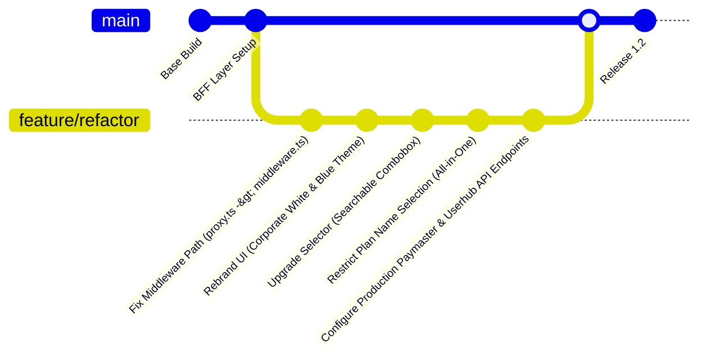

# 📊 Project_IA — Project Review & Architecture Presentation Document

This document serves as a comprehensive overview, technical breakdown, and architecture presentation guide for **Project_IA** (IntoAEC Administrative Control & Customer Success Control Plane). It is designed to guide reviewers, stakeholders, and developers through the project's design choices, implementation details, workflows, and current status.

---

## 1. Executive Summary

**Project_IA** is a secure, high-performance, full-stack administrative portal built for **IntoAEC**. It aggregates internal business operations into a unified interface, divided into two core operational pillars:
1. **Sales & Subscription Control**: Empowers administrators to search client organizations, review active subscription stats, perform contract renewals, generate manual receipts, and govern percentage-based discount coupons.
2. **Customer Success Control Panel**: Enables CSMs (Customer Success Managers) to view portfolio-wide health indexes, monitor active user thresholds, track ARR metrics, and leverage context-aware AI insights to prevent client churn.

---

## 2. Technical Stack & Design System

### 💻 Technology Stack

| Layer | Technology / Framework | Architectural Role |
| :--- | :--- | :--- |
| **Framework** | Next.js 16.2 (App Router) | Handles both client-side interactive rendering and secure serverless route handlers. |
| **Language** | TypeScript 5.x | Strict type safety across client interfaces, services, and backend utilities. |
| **Database** | PostgreSQL | Handles administrative user registration, passwords, and active session tracking. |
| **Styling** | Tailwind CSS 4 & Vanilla CSS | Custom design system enforcing modern layout principles, responsiveness, and dark mode. |
| **AI Layer** | Google Gemini API (`@google/genai`) | Serves context-rich analytics and actionable recommendations based on client usage. |
| **Security** | Custom JWT + HTTP-Only Cookies + Rate Limiting | High-security session tracking with sliding-window brute-force protection. |

### 🎨 Design System & Visual Identity
The dashboard UI was recently standardized to a **corporate-aligned, premium blue-and-white theme** which ensures consistent branding across all screens:
* **Backgrounds**: Flat pristine white (`#FFFFFF`) or light grey containers with strict `#E5E7EB` borders.
* **Typography**: Deep black (`#000000`) for high-contrast headers, labels, and text elements.
* **Brand Accents**: Primary actions, interactive states, icons, and status indicators utilize a uniform brand blue (`#1D6FD8`).
* **Border Radii**: Strict `16px` (rounded-2xl) corners on all cards and tables for a sleek, cohesive structural look.

---

## 3. High-Level System Architecture

The application implements a **BFF (Backend-for-Frontend) Proxy Pattern** to abstract downstream microservices away from the browser, preventing API key exposure and bypassing CORS issues.

```mermaid
flowchart TD
    subgraph Browser ["Client Interface (React 19)"]
        UI_Auth["Auth Screens (/login, /signup)"]
        UI_Sales["Sales & Subscriptions Dashboard (/dashboard/sales)"]
        UI_Receipts["Manual Receipt Generator (/dashboard/sales/receipt)"]
        UI_CS["Customer Success Center (/dashboard/customer-success)"]
    end

    subgraph Edge ["Edge Layer / Server Middleware"]
        MW["src/middleware.ts (Route Guard & JWT Check)"]
    end

    subgraph BFF ["Next.js BFF API Routes (/src/app/api)"]
        API_Auth["/api/auth/* (login, signup, refresh, logout)"]
        API_Paymaster["/api/paymaster & /api/paymaster-admin (Proxy)"]
        API_CS["/api/customer-success & /api/portfolio-batch (Proxy)"]
        API_AI["/api/ai-assistant (Gemini Integration)"]
    end

    subgraph Backend ["Backend & External Services"]
        Postgres[(PostgreSQL DB)]
        Paymaster[Paymaster Microservice (Prod)]
        Autopilot[AEC Autopilot Service]
        Gemini[Google Gemini API]
    end

    UI_Auth --> MW
    UI_Sales --> MW
    UI_Receipts --> MW
    UI_CS --> MW

    MW -->|Authorized Request| BFF
    MW -->|Unauthorized| UI_Auth

    API_Auth --> Postgres
    API_Paymaster --> Paymaster
    API_CS --> Autopilot
    API_AI --> Gemini
```

---

## 4. Detailed Core Modules

### 4.1. Sales & Subscription Management
* **Organization Selection**: Built with a highly responsive, searchable **Combobox** component that lists client companies alphabetically, letting administrators search and select dynamically without page stutter.
* **Subscription Extension**: Displays real-time organization information (User seats, Current Plan, Renewal Date). Admins can extend subscriptions. The system enforces a validation rule requiring the new expiry date to be at least `current_expiry + 1 day`.
* **Coupons Control**: Offers a dedicated interface to create percentage-based coupons or delete existing ones with instant state updates.

### 4.2. Manual Receipt Generator
* **Account Verification**: Administrators verify the organization's account ID via `/api/session` which calls the `Userhub` backend to fetch valid client metadata.
* **Plan Lock**: Enforces a strict guard where only the `"All in One Plan"` is eligible for manual receipt generation. All other selections are restricted to avoid misconfiguration.
* **Automated Gateway Detection**: Entering a 2-character country code (e.g., `US`, `ES`, `IN`) triggers automated gateway detection. It retrieves the correct currency symbol, tax rate, and payment gateway configuration dynamically.
* **Automatic Link Redirection**: Submitting the form issues a receipt to the production Paymaster system, returns a link, and **automatically opens the generated invoice link in a new browser tab** for quick printing.

### 4.3. Customer Success & AI Assistant
* **Retention Gauges & Metrics**: Renders visual indicators for ARR, active users, and portfolio-wide retention rates.
* **Autopilot Alerts**: Surfaces automated notices for accounts that exhibit decreasing usage patterns (e.g., low login rates, empty workspaces).
* **Gemini Assistant**: A sidebar widget allowing CSMs to ask questions (e.g., *"Which organizations are at risk of churning next month?"*). The BFF forwards the prompt combined with the client database context to the Gemini model, returning structured, actionable advice.

---

## 5. Security & Session Lifecycle

The project enforces high-level web security standards across authentication and request handling:

1. **Dual-Token Strategy**: 
   * **Access Token**: Lightweight, short-lived JWT (15-minute expiration) signed via `HS256`.
   * **Refresh Token**: Long-lived JWT (7-day expiration) containing a unique `jti` (JWT ID).
2. **HttpOnly Cookie Storage**: Both tokens are stored in browser cookies with `httpOnly`, `secure: true` (in production), and `sameSite: strict` properties. This protects the session tokens from Cross-Site Scripting (XSS) and Cross-Site Request Forgery (CSRF).
3. **Replay & Reuse Detection**: If a revoked refresh token is presented, the database immediately invalidates **all** active refresh tokens associated with that user ID to stop token hijacking.
4. **Brute Force Mitigation**: Authentication routes (`/login` and `/signup`) run through an in-memory sliding-window rate limiter restricting attempts by IP address.
5. **Downstream Metadata Headers**: The Middleware validates the `access_token` on incoming dashboard requests. Upon verification, it appends `x-user-id`, `x-user-role`, and `x-user-email` headers to the request, passing details to the route handlers.

---

## 6. Recent Development Highlights & Refactoring

In preparation for this review, the following enhancements were implemented to polish the system’s usability, security, and styling:



1. **Renamed Middleware Configuration**: Moved and corrected the edge-auth gateway from `proxy.ts` to `middleware.ts` at the root directory so Next.js intercepts protected paths (`/dashboard` and `/api/admin`) correctly.
2. **Visual Rebranding**: Refactored dashboard panels, buttons, badges, and text structures. Shifted from generic gray-green tables to high-contrast white tables with blue accent buttons and neutral thin grey borders.
3. **UX Improvements**: Replaced static, hard-to-navigate select dropdowns with a search-as-you-type combobox for smooth navigation of thousands of organizations.
4. **Production Routing**: Reconfigured local environment variables and proxy endpoints to route queries directly to the production Userhub session manager (`https://userhub.intoaec.ai/session`) and Paymaster API (`https://paymaster.intoaec.ai`), successfully transitioning out of test/mock environments.

---

## 7. Recommended Next Steps & Roadmap

To further elevate the project's quality, the following roadmap is recommended:
* **Distributed Rate Limiting**: Transition the in-memory sliding-window rate limiter in `utils/rate-limit.ts` to a **Redis-backed cache** to support horizontal scaling across Vercel serverless functions.
* **Cron-Based Token Cleanup**: Schedule a nightly database cron query to delete revoked or expired rows from the `refresh_tokens` table to prevent size bloat.
* **Automated Receipt Emails**: Extend the receipt generation route handler to dispatch the PDF invoice URL directly to the user’s billing email.

---

*This document was compiled for the Project IA Technical Review Board. Feel free to export it as PDF or Markdown.*
