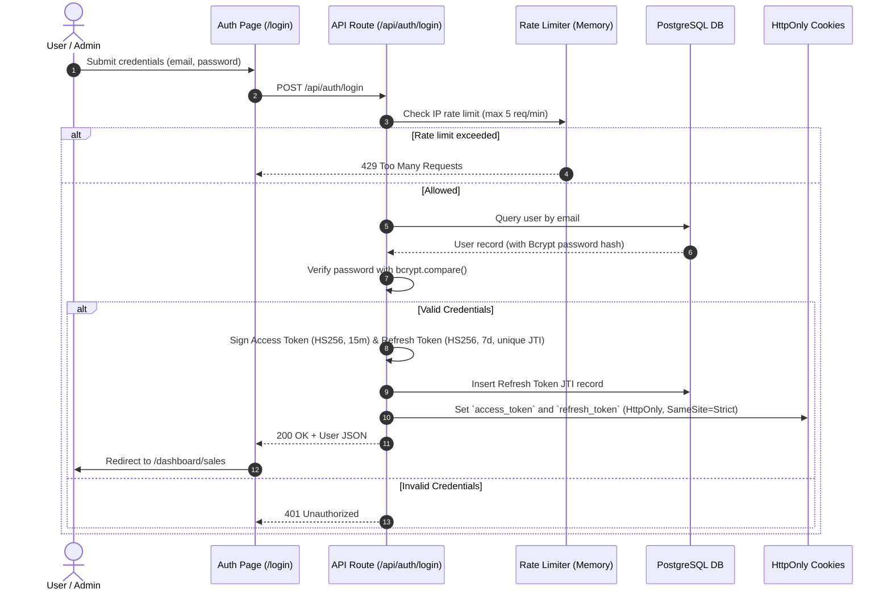
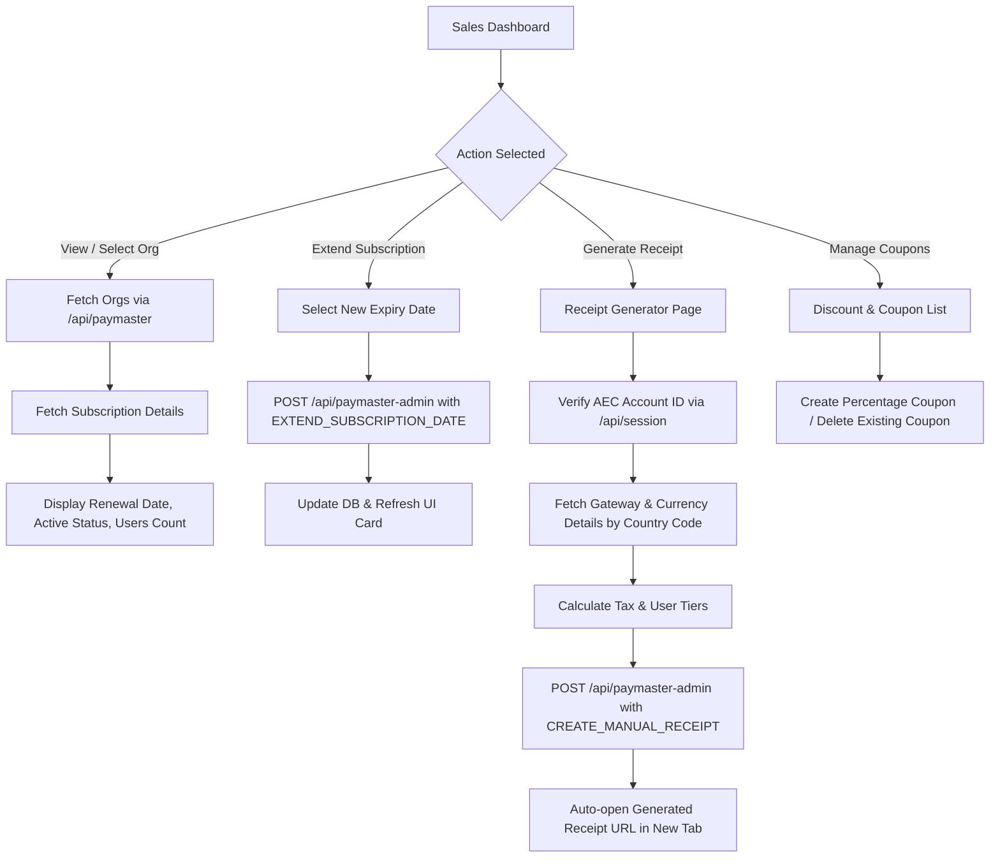
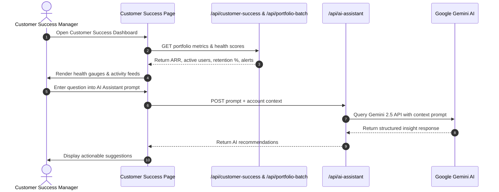

# IntoAEC Admin Portal — Project Architecture & Workflow Documentation

This document provides a comprehensive technical analysis and workflow documentation for **Project_IA** (IntoAEC Admin & Customer Success Control Plane).

---

## 1. High-Level Architecture Overview

**Project_IA** is built using Next.js 16 (App Router), React 19, TypeScript, and Tailwind CSS. It serves as the centralized administrative portal for IntoAEC, offering modules for **Sales & Subscription Management**, **Customer Success Analytics**, **Coupon & Discount Control**, and **AI-Driven Customer Insights**.

### Core Technology Stack

| Layer | Technologies / Libraries | Description |
|---|---|---|
| **Framework** | Next.js 16.2 (App Router), React 19.2, TypeScript 5 | Server and Client rendering with App Router architecture |
| **Styling & Icons** | Tailwind CSS 4, Lucide React Icons | Modern UI styling, dark mode, responsive layouts |
| **Data & Visualizations** | Recharts, Axios | Interactive metrics charts and HTTP API client |
| **Authentication & Security** | `jose` (JWT), `bcrypt`, Custom Rate Limiter | Stateless JWT access/refresh token rotation with HttpOnly cookies & sliding-window rate limiting |
| **Database** | PostgreSQL (`pg` pool connection) | Local/Remote database for user credentials and refresh token rotation tracking |
| **AI Integration** | `@google/genai` (Google Gemini API) | Context-aware AI assistant for customer success analysis |
| **BFF & Microservices** | Next.js Route Handlers (`/app/api/*`) | Proxy layer forwarding requests to external backends (`Paymaster`, `AECAutopilot`, `Userhub`) |

---

## 2. System Architecture & Component Diagram

```mermaid
flowchart TD
    subgraph Browser ["Client Browser (React 19)"]
        UI_Login["Auth Pages (/login, /signup)"]
        UI_Sales["Sales Module (/dashboard/sales)"]
        UI_CS["Customer Success (/dashboard/customer-success)"]
        UI_Coupons["Discount & Coupons (/dashboard/sales/coupons)"]
    end

    subgraph NextMiddleware ["Edge / Server Middleware"]
        MW["src/middleware.ts (JWT Verification & Route Guard)"]
    end

    subgraph AppRouter ["Next.js App Router API Routes (/src/app/api)"]
        API_Auth["/api/auth/* (login, signup, refresh, logout)"]
        API_Paymaster["/api/paymaster & /api/paymaster-admin (Proxy)"]
        API_CS["/api/customer-success & /api/portfolio-batch"]
        API_AI["/api/ai-assistant (Gemini Handler)"]
    end

    subgraph BackendServices ["Backend Infrastructure (src/backend & External)"]
        DB[(PostgreSQL Database)]
        Gemini[Google Gemini API]
        Paymaster[Paymaster Backend (Port 9097)]
        Autopilot[AEC Autopilot Service]
    end

    UI_Login --> MW
    UI_Sales --> MW
    UI_CS --> MW
    UI_Coupons --> MW

    MW -->|Authenticated| AppRouter
    MW -->|Unauthenticated| UI_Login

    API_Auth --> DB
    API_AI --> Gemini
    API_Paymaster --> Paymaster
    API_CS --> Autopilot
```

---

## 3. Core System Workflows

---

### 3.1 Authentication & Session Lifecycle Workflow

The authentication system employs stateless signed JWTs with database-backed token rotation and revocation.



#### Key Rules & Security Controls:
1. **Domain Requirement**: Registration and login require an email ending with `@intoaec.ai`.
2. **Access Token**: Short-lived JWT (15 minutes expiration).
3. **Refresh Token**: Long-lived JWT (7 days expiration) with unique `jti`. Rotation occurs on refresh; reused/revoked tokens trigger full session invalidation.
4. **Middleware Protection**: Intercepts requests to `/dashboard/*` and `/api/admin/*`. Validates `access_token` cookie and injects `x-user-id`, `x-user-role`, `x-user-email` headers for downstream handlers.

---

### 3.2 Sales & Subscription Management Workflow

The Sales Module provides complete administrative control over subscriptions, manual receipt issuance, and promotion codes.



#### Workflow Steps for Sales Operations:
1. **Sales Dashboard (`/dashboard/sales`)**:
   - Fetches all organizations alphabetically on mount (`GET_ORGANIZATIONS_WITH_USER_COUNT`).
   - Inspects subscription details for any selected organization (`GET_ORGANIZATION_SUBSCRIPTION_DETAILS`).
   - Allows extending subscription expiration date (`EXTEND_SUBSCRIPTION_DATE`), enforcing a minimum date of `current_expiry + 1 day`.
2. **Manual Receipt Generator (`/dashboard/sales/receipt`)**:
   - **Verification**: User inputs an AEC Account ID; system verifies organization details via `/session` (`GET_ORGANIZATION_BY_ACCOUNT_ID`).
   - **Gateway Auto-detection**: Entering a 2-character country code triggers automatic fetching of currency symbol, tax rate, and gateway configuration.
   - **Submission & Execution**: Calculates financial summaries and issues `CREATE_MANUAL_RECEIPT` to `/api/paymaster-admin`. Upon receipt creation, the application opens the receipt link directly in a new tab and stores the summary in local history.
3. **Coupons & Discounts (`/dashboard/sales/coupons` & `/dashboard/sales/discount`)**:
   - Supports creating percentage-based promotion codes (`CREATE_DISCOUNT_COUPON`).
   - Lists active coupons with inline deletion confirmation (`DELETE_DISCOUNT_COUPON`).

---

### 3.3 Customer Success & AI Insights Workflow

The Customer Success Module aggregates usage statistics, user retention health scores, and automated alerts across customer portfolios.



---

## 4. Directory & Module Mapping

```text
src/
├── api/                             # Typed client-side API callers (browser -> route handlers)
│   ├── auth/                        # login, logout handlers
│   ├── common/                      # apiClient (Axios wrapper with interceptors), endpoints
│   ├── customer-success/            # account details, activities, autopilot, portfolio APIs
│   └── sales/                       # subscription, receipt, coupon API functions
│
├── app/                             # Next.js App Router entry points
│   ├── api/                         # HTTP API Route Handlers
│   │   ├── auth/                    # /api/auth (login, signup, refresh, logout, me)
│   │   ├── paymaster/               # Proxy to Paymaster subscriptions handler
│   │   ├── paymaster-admin/         # Proxy to Paymaster admin-apis handler
│   │   ├── customer-success/        # Customer success metrics endpoint
│   │   ├── ai-assistant/            # Google Gemini AI assistant route
│   │   ├── activities/              # User activity logs endpoint
│   │   ├── autopilot/               # Automated alerts endpoint
│   │   └── session/                 # Account verification & gateway proxy
│   ├── dashboard/                   # Dashboard routes & global layout
│   │   ├── sales/                   # Sales routes (dashboard, receipt, coupons, discount)
│   │   └── customer-success/        # Customer Success routes
│   ├── login/                       # Login page
│   ├── signup/                      # Signup page
│   ├── layout.tsx                   # Main HTML layout
│   ├── page.tsx                     # Root redirect
│   └── globals.css                  # Tailwind styles and custom utilities
│
├── backend/                         # Server-only business & database logic
│   ├── ai/                          # gemini.ts (Google Gemini SDK wrapper)
│   ├── auth/                        # tokens.ts (JWT signing/verifying), password.ts (Bcrypt)
│   ├── database/                    # pool.ts (PostgreSQL connection pool & auto-migrations)
│   └── security/                    # rate-limit.ts (Sliding window rate limiter)
│
├── components/                      # Reusable UI components
│   ├── common/                      # Buttons, inputs, card containers
│   └── layout/                      # Navbars, headers, submenus
│
├── modules/                         # Feature UI pages (Client components)
│   ├── customer-success/            # CustomerSuccessDashboardPage
│   └── sales/                       # SalesDashboardPage, ReceiptGeneratorPage, CouponsListPage, CreateDiscountPage
│
├── services/                        # Service façade layer bridging UI to API client
│   ├── authService.ts
│   ├── customerService.ts
│   ├── organizationService.ts
│   └── salesService.ts
│
├── types/                           # TypeScript interfaces and domain schemas
│   └── dashboard.ts                 # Shared API payload and UI model types
│
└── middleware.ts                    # Edge authentication middleware (Route guardian)
```

---

## 5. Security & Architectural Best Practices

1. **HttpOnly & Secure Cookies**: Access and refresh tokens are strictly stored in HttpOnly, SameSite=Strict cookies to defend against XSS token theft.
2. **Brute Force Protection**: In-memory sliding-window rate limiting restricts failed login/signup attempts by IP address.
3. **Layered Separation (Client / Server Boundary)**:
   - UI pages inside `modules/` call `services/`, which delegate to `api/`.
   - `src/api` client routines communicate exclusively with Next.js App Router handlers (`/api/*`).
   - Server-only assets (PostgreSQL queries, secret keys, JWT signing) reside strictly inside `src/backend/` and route handlers, preventing secret leakage into client JS bundles.
4. **Proxy Pattern (BFF)**: Route handlers serve as a proxy to external backend services (`Paymaster`, `Userhub`, `AECAutopilot`), abstracting microservice credentials and endpoint paths away from the frontend client.
