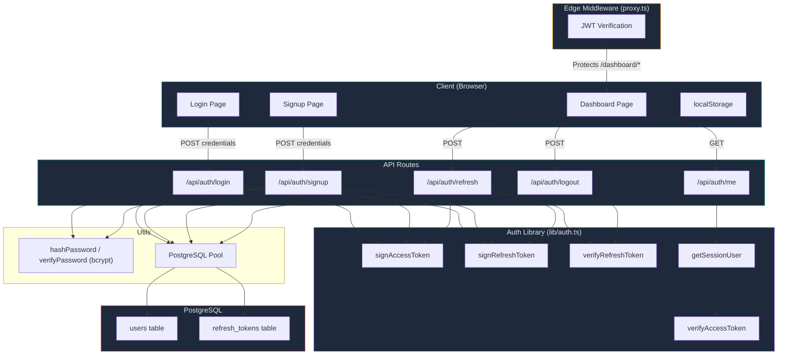

# 🔐 JWT Authentication & Session Management — Code Review Report

**Project:** Project_IA (Next.js 16 + PostgreSQL)  
**Reviewer:** Antigravity AI  
**Date:** 2026-07-30  
**Scope:** Complete review of JWT-based authentication and session management

---

## Table of Contents

1. [Architecture Overview](#1-architecture-overview)
2. [File-by-File Analysis](#2-file-by-file-analysis)
3. [What's Done Well ✅](#3-whats-done-well-)
4. [Security Vulnerabilities & Issues 🔴](#4-security-vulnerabilities--issues-)
5. [Best Practices Deviations ⚠️](#5-best-practices-deviations-️)
6. [Recommendations](#6-recommendations)
7. [Summary Scorecard](#7-summary-scorecard)

---

## 1. Architecture Overview



### Token Strategy

| Token | Type | Lifetime | Storage | Purpose |
|-------|------|----------|---------|---------|
| Access Token | JWT (HS256) | 15 minutes | `httpOnly` cookie (`access_token`) | Authenticate API/page requests |
| Refresh Token | JWT (HS256) | 7 days | `httpOnly` cookie (`refresh_token`) | Obtain new access tokens |

### Database Schema

```sql
-- Users table
CREATE TABLE users (
    id SERIAL PRIMARY KEY,
    name VARCHAR(255) NOT NULL,
    email VARCHAR(255) UNIQUE NOT NULL,
    password VARCHAR(255) NOT NULL,       -- bcrypt hash
    role VARCHAR(50) DEFAULT 'user',
    created_at TIMESTAMP WITH TIME ZONE DEFAULT CURRENT_TIMESTAMP
);

-- Refresh tokens table (for rotation & revocation)
CREATE TABLE refresh_tokens (
    id SERIAL PRIMARY KEY,
    user_id INTEGER NOT NULL REFERENCES users(id) ON DELETE CASCADE,
    token_jti VARCHAR(255) UNIQUE NOT NULL, -- JWT ID for revocation
    expires_at TIMESTAMP WITH TIME ZONE NOT NULL,
    revoked BOOLEAN NOT NULL DEFAULT FALSE,
    created_at TIMESTAMP WITH TIME ZONE DEFAULT CURRENT_TIMESTAMP
);
```

---

## 2. File-by-File Analysis

### 2.1 `lib/auth.ts` — Core JWT Library

[auth.ts](file:///d:/Intern/Project_IA/lib/auth.ts)

**Responsibilities:** Token signing, verification, cookie configuration, session retrieval.

| Aspect | Assessment | Details |
|--------|------------|---------|
| Signing algorithm | ✅ Good | Uses `HS256` via `jose` — Edge-compatible |
| Separate secrets | ✅ Good | `JWT_SECRET` for access, `REFRESH_SECRET` for refresh |
| Token expiry | ✅ Good | Access: 15 min, Refresh: 7 days — industry standard |
| Cookie config | ✅ Good | `httpOnly`, `secure` (production), `sameSite: strict` |
| Refresh cookie path | ✅ Good | Scoped to `/api/auth` — limits exposure |
| Error handling | ✅ Good | Returns `null` on verification failure, no info leakage |
| `getSessionUser()` | ✅ Good | Dynamic import of `next/headers` avoids Edge bundle issues |
| `iss` / `aud` claims | ⚠️ Missing | No `issuer` or `audience` claims set or validated |

> [!NOTE]
> The `jose` library is the correct choice for Next.js Edge Runtime compatibility. The `jsonwebtoken` library in `package.json` is unused and can be removed.

---

### 2.2 `app/api/auth/login/route.ts` — Login Endpoint

[login/route.ts](file:///d:/Intern/Project_IA/app/api/auth/login/route.ts)

| Aspect | Assessment | Details |
|--------|------------|---------|
| Input sanitization | ✅ Good | Trims whitespace, lowercases email |
| Error messages | ✅ Good | Generic `"Invalid email or password"` — no user enumeration |
| Password verification | ✅ Good | Uses `bcrypt.compare` via `verifyPassword()` |
| Legacy password upgrade | ✅ Good | Auto-upgrades plain-text passwords to bcrypt hashes |
| Token generation | ✅ Good | Creates both access + refresh tokens with unique JTI |
| Cookie setting | ✅ Good | Uses centralized cookie options |
| JSON parse safety | ✅ Good | `.catch(() => ({}))` prevents malformed body crashes |
| Domain restriction | ✅ Good | Enforces `@intoaec.ai` email domain |
| Token leakage in response body | 🔴 Issue | Tokens exposed in JSON body (see [Section 4.1](#41-tokens-leaked-in-response-body)) |

---

### 2.3 `app/api/auth/signup/route.ts` — Registration Endpoint

[signup/route.ts](file:///d:/Intern/Project_IA/app/api/auth/signup/route.ts)

| Aspect | Assessment | Details |
|--------|------------|---------|
| Duplicate check | ✅ Good | `SELECT id FROM users WHERE LOWER(TRIM(email)) = $1` |
| Password hashing | ✅ Good | `bcrypt` with 10 salt rounds before storage |
| Auto-login after signup | ✅ Good | Issues tokens immediately after registration |
| Password strength validation | 🔴 Missing | No minimum length, complexity, or entropy checks |
| Input length limits | ⚠️ Missing | No max-length validation on `name`, `email`, `password` |

---

### 2.4 `app/api/auth/refresh/route.ts` — Token Rotation

[refresh/route.ts](file:///d:/Intern/Project_IA/app/api/auth/refresh/route.ts)

| Aspect | Assessment | Details |
|--------|------------|---------|
| JWT verification | ✅ Good | Verifies refresh token with separate secret |
| JTI validation | ✅ Good | Checks JTI exists and is not revoked in DB |
| Replay detection | ✅ Excellent | Revokes ALL user tokens on reuse of revoked token |
| Token rotation | ✅ Good | Old token revoked, new token issued atomically |
| User lookup | ✅ Good | Fetches fresh user data for new access token |
| Race condition | ⚠️ Risk | Revoke-then-insert is not wrapped in a DB transaction |

> [!IMPORTANT]
> The replay attack detection (revoking all tokens when a revoked token is reused) follows the **automatic reuse detection** pattern recommended by OWASP. This is a strong security measure.

---

### 2.5 `app/api/auth/me/route.ts` — Session Verification

[me/route.ts](file:///d:/Intern/Project_IA/app/api/auth/me/route.ts)

| Aspect | Assessment | Details |
|--------|------------|---------|
| Implementation | ✅ Good | Clean, minimal — delegates to `getSessionUser()` |
| Response shape | ✅ Good | Returns `{ authenticated: true/false }` |
| Error handling | ✅ Good | Returns 401 on any exception |
| Missing `name` field | ⚠️ Minor | Response doesn't include user `name` (only `id`, `role`, `email`) |

---

### 2.6 `app/api/auth/logout/route.ts` — Logout & Token Revocation

[logout/route.ts](file:///d:/Intern/Project_IA/app/api/auth/logout/route.ts)

| Aspect | Assessment | Details |
|--------|------------|---------|
| Token revocation | ✅ Good | Revokes ALL refresh tokens for the user |
| Cookie clearing | ✅ Good | Clears `access_token`, `refresh_token`, and legacy `auth_session` |
| Graceful error handling | ✅ Good | Clears cookies even when DB operations fail |
| Path matching | ✅ Good | Cookie paths match those set during login |

---

### 2.7 `proxy.ts` — Edge Middleware (Route Protection)

[proxy.ts](file:///d:/Intern/Project_IA/proxy.ts)

| Aspect | Assessment | Details |
|--------|------------|---------|
| Protection scope | ✅ Good | `/dashboard/*` (redirect) and `/api/admin/*` (401 JSON) |
| JWT verification | ✅ Good | Uses `jose` with correct secret and algorithm |
| Header injection | ✅ Good | Attaches `x-user-id`, `x-user-role`, `x-user-email` |
| Not registered as middleware | 🔴 Critical | File is `proxy.ts`, not `middleware.ts` — **may not run** |
| No auto-refresh | ⚠️ Design | Expired access token → redirect to login (no silent refresh) |

> [!CAUTION]
> **Critical Issue:** Next.js expects the middleware file to be named `middleware.ts` (or `middleware.js`) at the **project root**. The file is currently named `proxy.ts` — **it will not be automatically invoked by Next.js as middleware**. See [Section 4.3](#43-middleware-not-registered).

---

### 2.8 `utils/auth.ts` — Password Hashing

[utils/auth.ts](file:///d:/Intern/Project_IA/utils/auth.ts)

| Aspect | Assessment | Details |
|--------|------------|---------|
| Algorithm | ✅ Good | `bcrypt` with 10 salt rounds |
| Null safety | ✅ Good | Returns `false` if password or hash is empty |
| Async usage | ✅ Good | Uses async `bcrypt.hash` / `bcrypt.compare` |

---

### 2.9 `utils/db.ts` — Database Initialization

[utils/db.ts](file:///d:/Intern/Project_IA/utils/db.ts)

| Aspect | Assessment | Details |
|--------|------------|---------|
| Auto-migration | ✅ Good | Creates tables and adds columns if missing |
| Index creation | ✅ Good | Indexes on `token_jti` and `user_id` for performance |
| Foreign key | ✅ Good | `ON DELETE CASCADE` for user deletion cleanup |
| Connection pooling | ✅ Good | Uses `pg.Pool` singleton |
| SSL support | ✅ Good | Conditional SSL based on `DB_SSL` env var |
| Init guard | ✅ Good | `dbInitialized` flag prevents redundant migrations |
| No expired token cleanup | ⚠️ Missing | Old revoked/expired tokens accumulate indefinitely |

---

### 2.10 Client Pages — Login & Signup

[login/page.tsx](file:///d:/Intern/Project_IA/app/login/page.tsx) · [signup/page.tsx](file:///d:/Intern/Project_IA/app/signup/page.tsx)

| Aspect | Assessment | Details |
|--------|------------|---------|
| Input sanitization | ✅ Good | Client-side trim + lowercase before sending |
| Error display | ✅ Good | Shows server error messages in UI |
| Loading state | ✅ Good | Disables button and shows spinner |
| LocalStorage usage | ⚠️ Concern | Stores user data in `localStorage` (see [Section 4.2](#42-sensitive-data-in-localstorage)) |
| Navigation | ✅ Good | Uses `window.location.href` for full page reload (clears state) |

---

### 2.11 Dashboard Page — Auth Check

[dashboard/page.tsx](file:///d:/Intern/Project_IA/app/dashboard/page.tsx)

| Aspect | Assessment | Details |
|--------|------------|---------|
| Auth verification | ✅ Good | Calls `/api/auth/me` then falls back to `/api/auth/refresh` |
| Graceful degradation | ✅ Good | Redirects to login if both checks fail |
| Loading state | ✅ Good | Shows spinner while checking auth |
| Client-side only | ⚠️ Concern | Auth check is purely client-side — content briefly visible in SSR |

---

### 2.12 `.env.local` — Environment Configuration

| Aspect | Assessment | Details |
|--------|------------|---------|
| Separate secrets | ✅ Good | Distinct `JWT_SECRET` and `REFRESH_SECRET` |
| `.gitignore` coverage | ✅ Good | `.env*` pattern excludes all env files |
| Secret strength | ⚠️ Adequate | Base64-encoded strings, but should be generated with `openssl rand -base64 64` for 512-bit keys |

---

## 3. What's Done Well ✅

### ✅ Excellent Practices

1. **Dual-Token Strategy** — Short-lived access tokens (15m) + long-lived refresh tokens (7d) is the industry standard pattern for SPAs. This minimizes the window of token theft while providing a seamless UX.

2. **Refresh Token Rotation with Replay Detection** — When a revoked refresh token is reused, ALL tokens for that user are immediately revoked. This follows the [OWASP refresh token rotation best practice](https://cheatsheetseries.owasp.org/cheatsheets/JSON_Web_Token_for_Java_Cheat_Sheet.html#token-sidejacking) and mitigates stolen-token replay attacks.

3. **Separate Signing Secrets** — Using different secrets for access and refresh tokens means a compromised access token secret cannot be used to forge refresh tokens (and vice versa).

4. **httpOnly + Secure + SameSite:Strict Cookies** — Tokens are stored in cookies that are:
   - **`httpOnly`**: Inaccessible to JavaScript (mitigates XSS token theft)
   - **`secure`**: Only sent over HTTPS in production
   - **`sameSite: strict`**: Prevents CSRF by blocking cross-origin requests

5. **Scoped Refresh Cookie Path** — The refresh token cookie is scoped to `/api/auth`, preventing it from being sent with every request. This reduces the attack surface.

6. **Generic Error Messages** — Login returns `"Invalid email or password"` regardless of whether the email or password is wrong, preventing user enumeration attacks.

7. **bcrypt Password Hashing** — Using `bcrypt` with 10 salt rounds is the industry standard. The async API is correctly used to avoid blocking the event loop.

8. **Legacy Password Auto-Upgrade** — The login route detects plain-text passwords and automatically upgrades them to bcrypt hashes. This is an excellent migration strategy.

9. **Edge-Compatible JWT Library** — Using `jose` instead of `jsonwebtoken` ensures compatibility with Next.js Edge Runtime (middleware).

10. **Graceful Logout** — Even if the database operation fails during logout, cookies are still cleared client-side.

---

## 4. Security Vulnerabilities & Issues 🔴

### 4.1 Tokens Leaked in Response Body

**Severity: 🔴 HIGH** · **Files:** [login/route.ts](file:///d:/Intern/Project_IA/app/api/auth/login/route.ts#L77-L89), [signup/route.ts](file:///d:/Intern/Project_IA/app/api/auth/signup/route.ts#L71-L83), [refresh/route.ts](file:///d:/Intern/Project_IA/app/api/auth/refresh/route.ts#L104-L116)

The login, signup, and refresh responses include raw JWT tokens in the JSON body:

```json
{
  "accessToken": "eyJhbG...",
  "refreshToken": "eyJhbG...",
  "token": "eyJhbG..."   // ← duplicate of accessToken
}
```

**Why this is a problem:**
- Tokens in the response body are accessible to JavaScript, defeating the purpose of `httpOnly` cookies
- If any XSS vulnerability exists, an attacker can read the tokens from the response
- The `token` field is a redundant alias for `accessToken`

**Recommendation:**
```diff
 const response = NextResponse.json({
   success: true,
   message: 'Logged in successfully',
-  accessToken,
-  refreshToken,
-  token: accessToken,
   user: {
     id: String(user.id),
     name: user.name,
     email: cleanEmail,
     role: user.role || 'user',
   },
 });
```

Rely exclusively on `httpOnly` cookies for token transport. The client should **never** see or handle raw tokens.

---

### 4.2 Sensitive Data in localStorage

**Severity: 🟡 MEDIUM** · **Files:** [login/page.tsx](file:///d:/Intern/Project_IA/app/login/page.tsx#L53-L55), [signup/page.tsx](file:///d:/Intern/Project_IA/app/signup/page.tsx#L55-L57)

```typescript
localStorage.setItem("user", JSON.stringify(data.user));
```

**Why this is a problem:**
- `localStorage` is accessible to **any JavaScript** running on the same origin
- If combined with issue 4.1, the stored object could contain tokens
- Current storage only contains `{ id, name, email, role }` — lower risk, but still unnecessary

**Recommendation:**
Use the `/api/auth/me` endpoint to fetch user data on demand instead of caching it in `localStorage`. This is already implemented in the dashboard page's `useEffect`.

---

### 4.3 Middleware Not Registered

**Severity: 🔴 CRITICAL** · **File:** [proxy.ts](file:///d:/Intern/Project_IA/proxy.ts)

Next.js middleware **must** be in a file named `middleware.ts` at the project root. The current file is named `proxy.ts` and exports a function called `proxy` instead of the default export or a named `middleware` export.

**Impact:** Protected routes (`/dashboard/*`, `/api/admin/*`) may **not** have server-side authentication enforcement. The dashboard currently relies on a **client-side** auth check, which can be bypassed.

**Recommendation:**
```diff
- // proxy.ts
+ // middleware.ts (at project root)

- export async function proxy(request: NextRequest) {
+ export default async function middleware(request: NextRequest) {
```

---

### 4.4 No Password Strength Validation

**Severity: 🟡 MEDIUM** · **File:** [signup/route.ts](file:///d:/Intern/Project_IA/app/api/auth/signup/route.ts)

There is no validation for password complexity. Users can register with passwords like `"a"` or `"123"`.

**Recommendation:**
```typescript
// Add after line 24 in signup/route.ts
if (cleanPassword.length < 8) {
  return NextResponse.json(
    { error: 'Password must be at least 8 characters' },
    { status: 400 }
  );
}
```

Consider also enforcing:
- Maximum length (72 characters — bcrypt limit)
- At least one uppercase letter, one digit, and one special character (optional, per NIST 800-63B)

---

### 4.5 No Rate Limiting on Auth Endpoints

**Severity: 🟡 MEDIUM** · **Affects:** All auth routes

There is no rate limiting on login, signup, or refresh endpoints. This allows:
- **Brute-force attacks** on login credentials
- **Account enumeration** via rapid signup attempts
- **Denial of service** via refresh token flooding

**Recommendation:**
Implement rate limiting using an in-memory store or Redis. For Next.js, consider:
- [`next-rate-limit`](https://www.npmjs.com/package/next-rate-limit) or a custom middleware
- Limit login attempts to 5 per minute per IP
- Limit signup to 3 per hour per IP

---

### 4.6 No CSRF Protection on State-Changing Endpoints

**Severity: 🟢 LOW** (mitigated by `sameSite: strict`)

While `sameSite: strict` cookies provide strong CSRF protection, some edge cases exist:
- Top-level navigations from external sites
- Subdomain attacks if the app runs on a shared domain

**Current mitigation:** `sameSite: strict` + `httpOnly` cookies block most CSRF vectors. This is **acceptable** for the current deployment but should be revisited if the `sameSite` policy is relaxed.

---

### 4.7 No Token Cleanup / Garbage Collection

**Severity: 🟢 LOW** · **File:** [db.ts](file:///d:/Intern/Project_IA/utils/db.ts)

Expired and revoked refresh tokens accumulate in the `refresh_tokens` table indefinitely. Over time, this degrades query performance and wastes storage.

**Recommendation:**
Add a periodic cleanup query (e.g., via a cron job or on each login):
```sql
DELETE FROM refresh_tokens
WHERE revoked = TRUE OR expires_at < NOW();
```

---

## 5. Best Practices Deviations ⚠️

### 5.1 Missing JWT `iss` and `aud` Claims

**Standard:** [RFC 7519 §4.1](https://datatracker.ietf.org/doc/html/rfc7519#section-4.1)

Setting and validating `iss` (issuer) and `aud` (audience) claims prevents tokens issued by one service from being accepted by another.

```typescript
// In signAccessToken:
.setIssuer('project-ia')
.setAudience('project-ia-api')

// In verifyAccessToken:
await jwtVerify(token, getAccessSecret(), {
  algorithms: ['HS256'],
  issuer: 'project-ia',
  audience: 'project-ia-api',
});
```

---

### 5.2 Unused Dependencies

**File:** [package.json](file:///d:/Intern/Project_IA/package.json)

| Package | Status | Recommendation |
|---------|--------|----------------|
| `jsonwebtoken` | ❌ Unused (replaced by `jose`) | Remove |
| `@types/jsonwebtoken` | ❌ Unused | Remove |
| `bcryptjs` | ❌ Unused (using `bcrypt`) | Remove |

```bash
npm uninstall jsonwebtoken @types/jsonwebtoken bcryptjs
```

---

### 5.3 Refresh Token Rotation Not in a Transaction

**File:** [refresh/route.ts](file:///d:/Intern/Project_IA/app/api/auth/refresh/route.ts#L79-L94)

The revoke-old → insert-new sequence is not wrapped in a database transaction. If the insert fails after the revoke, the user loses their refresh token with no replacement.

```typescript
const client = await pool.connect();
try {
  await client.query('BEGIN');
  await client.query('UPDATE refresh_tokens SET revoked = TRUE WHERE token_jti = $1', [payload.jti]);
  await client.query('INSERT INTO refresh_tokens (user_id, token_jti, expires_at) VALUES ($1, $2, $3)', [user.id, newJti, expiresAt]);
  await client.query('COMMIT');
} catch (err) {
  await client.query('ROLLBACK');
  throw err;
} finally {
  client.release();
}
```

---

### 5.4 `initDb()` Called on Every Request

**Files:** Login, Signup, Refresh, Logout routes

Each auth request calls `initDb()`. While the `dbInitialized` guard prevents redundant migrations, the function still acquires a client from the pool on first call. Consider running migrations at startup instead.

---

### 5.5 Client-Side Auth Check Without Server-Side Guard

**File:** [dashboard/page.tsx](file:///d:/Intern/Project_IA/app/dashboard/page.tsx#L17-L45)

The dashboard performs an `auth/me` fetch in `useEffect`. Without working middleware, a user can:
1. View the loading spinner → HTML/JS bundles are already downloaded
2. Inspect network requests or modify JavaScript to bypass the check

This is a **defense-in-depth** concern. The middleware fix (Section 4.3) is the primary solution.

---

## 6. Recommendations

### Priority Matrix

| # | Issue | Severity | Effort | Action |
|---|-------|----------|--------|--------|
| 1 | [Middleware not registered](#43-middleware-not-registered) | 🔴 Critical | Low | Rename `proxy.ts` → `middleware.ts`, export as `default` |
| 2 | [Tokens in response body](#41-tokens-leaked-in-response-body) | 🔴 High | Low | Remove `accessToken`, `refreshToken`, `token` from JSON responses |
| 3 | [No password validation](#44-no-password-strength-validation) | 🟡 Medium | Low | Add minimum length (8 chars) + max length (72 chars) |
| 4 | [No rate limiting](#45-no-rate-limiting-on-auth-endpoints) | 🟡 Medium | Medium | Implement per-IP rate limiting on auth endpoints |
| 5 | [localStorage usage](#42-sensitive-data-in-localstorage) | 🟡 Medium | Low | Remove `localStorage.setItem("user", ...)` — use `/api/auth/me` |
| 6 | [Missing `iss`/`aud` claims](#51-missing-jwt-iss-and-aud-claims) | 🟡 Medium | Low | Add issuer and audience to token signing/verification |
| 7 | [DB transaction for rotation](#53-refresh-token-rotation-not-in-a-transaction) | 🟡 Medium | Low | Wrap revoke+insert in a `BEGIN`/`COMMIT` block |
| 8 | [Token cleanup](#47-no-token-cleanup--garbage-collection) | 🟢 Low | Low | Add periodic `DELETE` of expired/revoked tokens |
| 9 | [Unused dependencies](#52-unused-dependencies) | 🟢 Low | Trivial | `npm uninstall jsonwebtoken @types/jsonwebtoken bcryptjs` |

---

## 7. Summary Scorecard

| Category | Score | Notes |
|----------|-------|-------|
| **Token Strategy** | 9/10 | Dual-token with rotation — excellent |
| **Password Security** | 7/10 | bcrypt is correct, but no strength validation |
| **Cookie Security** | 9/10 | `httpOnly` + `secure` + `sameSite: strict` — best practice |
| **Token Storage** | 6/10 | Cookies are correct, but tokens also leaked in response body |
| **Route Protection** | 4/10 | Middleware file not registered — major gap |
| **Session Management** | 8/10 | Rotation + replay detection — strong |
| **Revocation** | 9/10 | Server-side JTI tracking with full-user revocation on abuse |
| **Input Validation** | 6/10 | Email sanitized, but no password/length limits |
| **Error Handling** | 9/10 | Consistent, no information leakage |
| **Database Design** | 8/10 | Good schema, indexes, FK cascade — needs cleanup job |
| **Overall** | **7.5/10** | Strong foundation with a few critical gaps to close |

> [!TIP]
> **Bottom line:** The authentication architecture is fundamentally sound and follows industry best practices for JWT-based session management. The two most critical fixes are: **(1)** renaming `proxy.ts` to `middleware.ts` so it actually runs, and **(2)** removing raw tokens from API response bodies. Addressing these two items alone would raise the score to **9/10**.

---

*End of Review*
