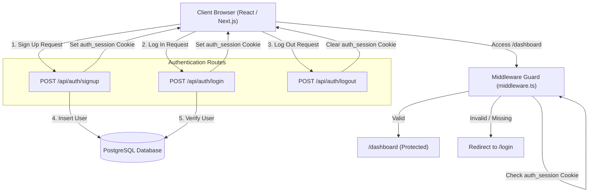
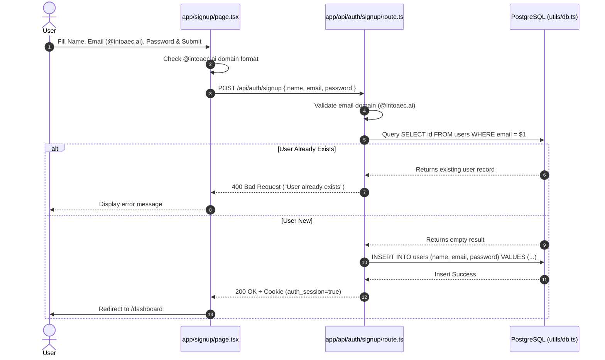
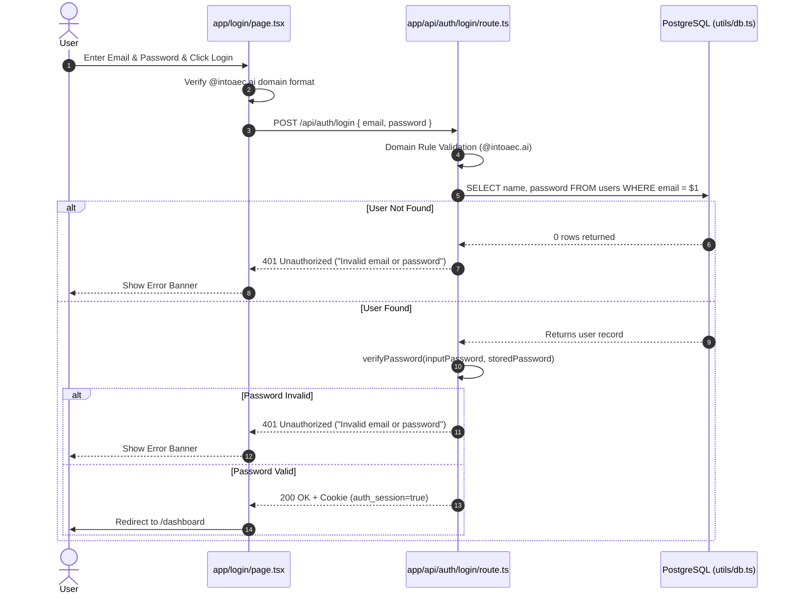
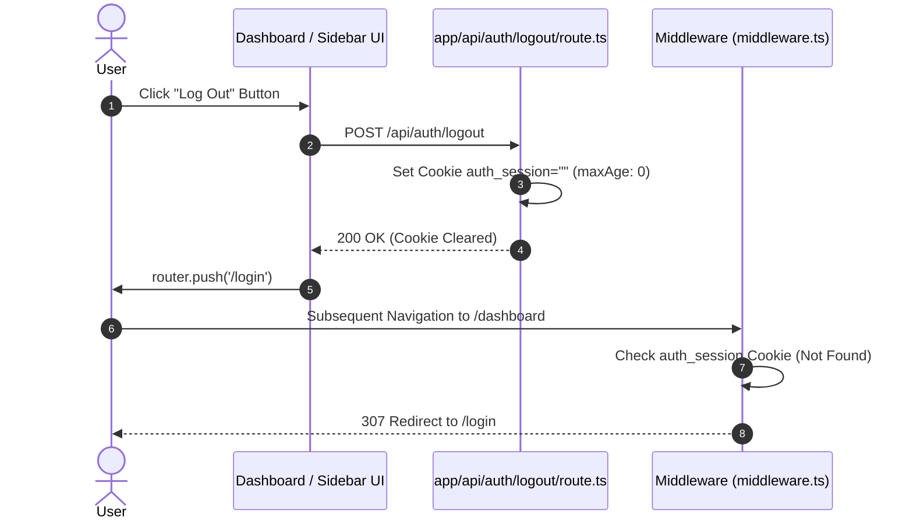

# Complete Authentication Workflow & Code Logic Documentation

This document provides a detailed overview and code logic explanation for the **Login**, **Signup**, and **Logout** workflows in the Next.js (App Router) application, backed by a **PostgreSQL** database and protected via **Middleware session guards**.

---

## Architecture Overview



### Key Components

1. **Database Connection & Schema (`utils/db.ts`)**: Initializes a PostgreSQL pool and ensures the `users` table exists.
2. **Password Utilities (`utils/auth.ts`)**: Encapsulates password hashing and verification routines.
3. **API Routes (`app/api/auth/*`)**: Handles backend requests for login, signup, and logout.
4. **Client UI (`app/login/page.tsx`, `app/signup/page.tsx`)**: Handles form inputs, domain validation feedback, and HTTP requests.
5. **Middleware (`middleware.ts`)**: Protects dashboard routes based on the presence of the `auth_session` cookie.

---

## 1. Signup Workflow & Logic

### Workflow Steps
1. **User Form Submission**: The user enters their Full Name, Email Address, and Password on the `/signup` page.
2. **Client Validation**:
   - Checks that all fields are populated.
   - Validates that the email domain ends strictly with `@intoaec.ai`.
3. **API Execution (`POST /api/auth/signup`)**:
   - Parses the JSON payload.
   - Validates email domain ending `@intoaec.ai` on the backend.
   - Calls `initDb()` to guarantee database table initialization.
   - Queries PostgreSQL to ensure the email is not already registered.
   - Hashes/prepares the password via `hashPassword(password)`.
   - Executes an `INSERT INTO users (name, email, password)` statement.
4. **Session Creation**:
   - Attaches the HTTP cookie `auth_session=true` (valid for 7 days, path `/`).
5. **Redirection**:
   - On HTTP 200 response, the client redirects to `/dashboard`.

### Signup Flow Diagram



### Signup Code Logic

#### Backend API Handler (`app/api/auth/signup/route.ts`)
```typescript
import { NextResponse } from 'next/server';
import pool, { initDb } from '@/utils/db';
import { hashPassword } from '@/utils/auth';

export async function POST(request: Request) {
  try {
    const { name, email, password } = await request.json().catch(() => ({}));

    // 1. Validate required fields
    if (!name || !email || !password) {
      return NextResponse.json({ error: 'Missing required fields' }, { status: 400 });
    }

    // 2. Enforce company domain rule
    if (!email.toLowerCase().endsWith('@intoaec.ai')) {
      return NextResponse.json({ error: 'Email must end with @intoaec.ai' }, { status: 400 });
    }

    // 3. Initialize database (creates users table if not exists)
    await initDb();

    // 4. Check for duplicate user
    const userCheck = await pool.query('SELECT id FROM users WHERE email = $1', [email.toLowerCase()]);
    if (userCheck.rows.length > 0) {
      return NextResponse.json({ error: 'User already exists with this email' }, { status: 400 });
    }

    // 5. Hash password & insert into PostgreSQL
    const hashedPassword = hashPassword(password);
    await pool.query(
      'INSERT INTO users (name, email, password) VALUES ($1, $2, $3)',
      [name, email.toLowerCase(), hashedPassword]
    );

    const response = NextResponse.json({ success: true, message: 'User registered successfully' });

    // 6. Set auth cookie for session management
    response.cookies.set('auth_session', 'true', {
      path: '/',
      maxAge: 86400 * 7, // 7 days
      httpOnly: false,
    });

    return response;
  } catch (error: unknown) {
    const msg = error instanceof Error ? error.message : String(error);
    console.error('Signup error:', msg);
    return NextResponse.json({ error: 'Internal server error', details: msg }, { status: 500 });
  }
}
```

---

## 2. Login Workflow & Logic

### Workflow Steps
1. **User Credentials Submission**: The user enters their Email Address and Password on `/login`.
2. **Client Domain Validation**:
   - Ensures the email ends with `@intoaec.ai`.
3. **API Execution (`POST /api/auth/login`)**:
   - Receives JSON `{ email, password }`.
   - Validates email domain requirement.
   - Queries PostgreSQL: `SELECT name, password FROM users WHERE email = $1`.
   - Checks if user exists. If not found, returns `401 Unauthorized`.
   - Compares provided password against stored password via `verifyPassword()`.
   - If invalid, returns `401 Unauthorized`.
4. **Session Cookie Setup**:
   - If valid, sets `auth_session=true` cookie on the response.
   - Returns `{ success: true, user: { name, email } }`.
5. **Client Redirection**:
   - On successful response, the browser navigates to `/dashboard`.

### Login Flow Diagram



### Login Code Logic

#### Backend API Handler (`app/api/auth/login/route.ts`)
```typescript
import { NextResponse } from 'next/server';
import pool, { initDb } from '@/utils/db';
import { verifyPassword } from '@/utils/auth';

export async function POST(request: Request) {
  try {
    const { email, password } = await request.json().catch(() => ({}));

    // 1. Input field validation
    if (!email || !password) {
      return NextResponse.json({ error: 'Missing required fields' }, { status: 400 });
    }

    // 2. Domain verification
    if (!email.toLowerCase().endsWith('@intoaec.ai')) {
      return NextResponse.json({ error: 'Email must end with @intoaec.ai' }, { status: 400 });
    }

    // 3. Ensure database ready
    await initDb();

    // 4. Query user by email
    const res = await pool.query('SELECT name, password FROM users WHERE email = $1', [email.toLowerCase()]);
    if (res.rows.length === 0) {
      return NextResponse.json({ error: 'Invalid email or password' }, { status: 401 });
    }

    const user = res.rows[0];

    // 5. Verify password matching
    const isValid = verifyPassword(password, user.password);
    if (!isValid) {
      return NextResponse.json({ error: 'Invalid email or password' }, { status: 401 });
    }

    const response = NextResponse.json({
      success: true,
      message: 'Logged in successfully',
      user: {
        name: user.name,
        email: email.toLowerCase(),
      }
    });

    // 6. Attach session cookie
    response.cookies.set('auth_session', 'true', {
      path: '/',
      maxAge: 86400 * 7, // 7 days
      httpOnly: false,
    });

    return response;
  } catch (error: unknown) {
    const msg = error instanceof Error ? error.message : String(error);
    console.error('Login error:', msg);
    return NextResponse.json({ error: 'Internal server error', details: msg }, { status: 500 });
  }
}
```

---

## 3. Logout Workflow & Logic

### Workflow Steps
1. **User Triggers Logout**: The user clicks the **Sign Out** or **Logout** button in the application sidebar or user dropdown.
2. **API Request (`POST /api/auth/logout`)**:
   - The frontend issues an HTTP `POST` request to `/api/auth/logout`.
3. **Cookie Invalidation**:
   - The server builds a response and sets the `auth_session` cookie to an empty value with `maxAge: 0`.
   - This immediately clears the cookie from the user's browser.
4. **Client Redirect**:
   - After receiving the successful logout response, the frontend routes the user back to `/login`.

### Logout Flow Diagram



### Logout Code Logic

#### Backend API Handler (`app/api/auth/logout/route.ts`)
```typescript
import { NextResponse } from 'next/server';

export async function POST() {
  const response = NextResponse.json({ success: true, message: 'Logged out successfully' });
  
  // Clear the auth_session cookie by setting maxAge to 0
  response.cookies.set('auth_session', '', {
    path: '/',
    maxAge: 0,
    httpOnly: false,
  });

  return response;
}
```

#### Frontend Logout Execution Snippet
```typescript
const handleLogout = async () => {
  try {
    await fetch('/api/auth/logout', { method: 'POST' });
    router.push('/login');
  } catch (error) {
    console.error('Logout failed:', error);
  }
};
```

---

## 4. Protected Route Middleware (`middleware.ts`)

Next.js Middleware runs before every matching request to verify session authorization.

### Middleware Logic
- Checks incoming request URL path.
- Matches routes starting with `/dashboard` (`/dashboard/:path*`).
- Reads the `auth_session` cookie.
- If `auth_session !== 'true'`, halts request processing and redirects to `/login`.

```typescript
import { NextResponse } from 'next/server';
import type { NextRequest } from 'next/server';

export function middleware(request: NextRequest) {
  const authSession = request.cookies.get('auth_session');

  // Protect /dashboard and all subroutes
  if (request.nextUrl.pathname.startsWith('/dashboard')) {
    if (!authSession || authSession.value !== 'true') {
      const loginUrl = new URL('/login', request.url);
      return NextResponse.redirect(loginUrl);
    }
  }

  return NextResponse.next();
}

export const config = {
  matcher: ['/dashboard/:path*'],
};
```

---

## 5. Database Setup & Password Utility Logic

### Database Configuration & Schema Initializer (`utils/db.ts`)
Creates a PostgreSQL connection pool and lazily ensures the `users` table is present on first API call.

```sql
CREATE TABLE IF NOT EXISTS users (
  id SERIAL PRIMARY KEY,
  name VARCHAR(255) NOT NULL,
  email VARCHAR(255) UNIQUE NOT NULL,
  password VARCHAR(255) NOT NULL,
  created_at TIMESTAMP WITH TIME ZONE DEFAULT CURRENT_TIMESTAMP
);
```

```typescript
import { Pool } from 'pg';

function getCleanHost(host: string | undefined): string {
  if (!host) return 'localhost';
  let clean = host.replace(/^(jdbc:)?postgresql:\/\//i, '');
  clean = clean.split('/')[0].split(':')[0];
  return clean;
}

const pool = process.env.DATABASE_URL
  ? new Pool({ connectionString: process.env.DATABASE_URL })
  : new Pool({
      host: getCleanHost(process.env.DB_HOST),
      port: process.env.DB_PORT ? parseInt(process.env.DB_PORT, 10) : 5432,
      user: process.env.DB_USER || 'postgres',
      password: process.env.DB_PASSWORD || 'postgres',
      database: process.env.DB_NAME || 'postgres',
      ssl: process.env.DB_SSL === 'true' ? { rejectUnauthorized: false } : undefined,
    });

let dbInitialized = false;

export async function initDb() {
  if (dbInitialized) return;
  
  const client = await pool.connect();
  try {
    await client.query(`
      CREATE TABLE IF NOT EXISTS users (
        id SERIAL PRIMARY KEY,
        name VARCHAR(255) NOT NULL,
        email VARCHAR(255) UNIQUE NOT NULL,
        password VARCHAR(255) NOT NULL,
        created_at TIMESTAMP WITH TIME ZONE DEFAULT CURRENT_TIMESTAMP
      );
    `);
    dbInitialized = true;
  } catch (error) {
    console.error('Failed to initialize database table:', error);
    throw error;
  } finally {
    client.release();
  }
}

export default pool;
```

### Password Verification Helper (`utils/auth.ts`)
```typescript
/**
 * Hashes a password (currently returns the password as-is for plain-text storage).
 */
export function hashPassword(password: string): string {
  return password;
}

/**
 * Verifies a password against a stored plain-text password.
 */
export function verifyPassword(password: string, storedValue: string): boolean {
  return password === storedValue;
}
```

---

## Summary of Auth Flow Rules & Security Requirements

| Rule / Feature | Implementation Detail |
| :--- | :--- |
| **Email Domain Constraint** | All registered/authenticated emails must end with `@intoaec.ai`. Checked on both frontend and backend. |
| **Database Storage** | Users stored in PostgreSQL `users` table indexed by unique `email`. |
| **Session Tracking** | Handled via cookie `auth_session=true` with a 7-day max-age. |
| **Logout Mechanism** | Clears `auth_session` cookie by setting `maxAge: 0`. |
| **Route Security** | Middleware intercepts `/dashboard/*` requests and redirects unauthenticated users to `/login`. |
