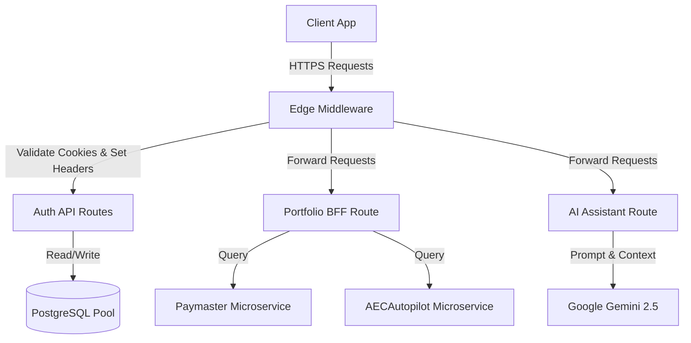

# Project_IA Backend Architecture and Code Documentation

This document contains a comprehensive analysis and the complete codebase of the backend system implemented for **Project_IA** (IntoAEC Customer Success Dashboard).

---

## Table of Contents
1. [Backend Overview & Architecture](#1-backend-overview--architecture)
2. [Database Layer & Connection Pool](#2-database-layer--connection-pool)
3. [JWT Management & Security Middleware](#3-jwt-management--security-middleware)
4. [Authentication Utilities & Rate Limiting](#4-authentication-utilities--rate-limiting)
5. [Authentication Endpoints (Route Handlers)](#5-authentication-endpoints-route-handlers)
6. [BFF & Microservices Integration Routes](#6-bff--microservices-integration-routes)
7. [AI Assistant Integration](#7-ai-assistant-integration)

---

## 1. Backend Overview & Architecture

Project_IA is built using **Next.js (App Router)** as a full-stack framework. The backend layer consists of serverless Edge-compatible route handlers under `/api` that handle:
- **Stateless Session Management**: Using secure HTTP-only cookies containing signed Access Tokens (JWT, 15m expiration) and rotated Refresh Tokens (JWT, 7d expiration).
- **Atomic Token Rotation**: Protecting against session replay attacks via database-backed JWT tracking, transaction-based token rotation, and single-use constraints.
- **Microservices Proxy / BFF (Backend-For-Frontend)**: Consolidating and formatting requests for external microservices:
  - **Paymaster**: For subscription validity.
  - **AECAutopilot**: For customer activity tracking, automated alerts, and health indexes.
- **AI-Powered Insights**: Integrating with Google Gemini API (`gemini-2.5-flash`) via the `@google/genai` SDK to supply action-oriented advice for customer success teams.
- **Brute Force Defense**: Sliding-window rate limiting on critical authentication endpoints.



---

## 2. Database Layer & Connection Pool

The database helper manages connection pooling using the `pg` library, dynamically creates tables (including indices), and performs database migrations for role-based access and secure token rotation.

### File: `utils/db.ts`
```typescript
import { Pool } from 'pg';

function getCleanHost(host: string | undefined): string {
  if (!host) return 'localhost';
  // Remove jdbc:postgresql:// or postgresql:// prefix if present
  let clean = host.replace(/^(jdbc:)?postgresql:\/\//i, '');
  // Remove port and database suffix if present, e.g. 34.27.246.185:5432/AEC_USERS -> 34.27.246.185
  clean = clean.split('/')[0].split(':')[0];
  return clean;
}

const pool = process.env.DATABASE_URL
  ? new Pool({ connectionString: process.env.DATABASE_URL })
  : new Pool({
      host: getCleanHost(process.env.DB_HOST),
      port: process.env.DB_PORT ? parseInt(process.env.DB_PORT, 10) : 5432,
      user: process.env.DB_USER || 'postgres',
      password: process.env.DB_PASSWORD || 'postgres',
      database: process.env.DB_NAME || 'postgres',
      ssl: process.env.DB_SSL === 'true' ? { rejectUnauthorized: false } : undefined,
    });

let dbInitialized = false;

export async function initDb() {
  if (dbInitialized) return;
  
  const client = await pool.connect();
  try {
    // Create users table if not exists
    await client.query(`
      CREATE TABLE IF NOT EXISTS users (
        id SERIAL PRIMARY KEY,
        name VARCHAR(255) NOT NULL,
        email VARCHAR(255) UNIQUE NOT NULL,
        password VARCHAR(255) NOT NULL,
        role VARCHAR(50) NOT NULL DEFAULT 'user',
        created_at TIMESTAMP WITH TIME ZONE DEFAULT CURRENT_TIMESTAMP
      );
    `);

    // Add role column if it doesn't exist (migration for existing DBs)
    await client.query(`
      DO $$
      BEGIN
        IF NOT EXISTS (
          SELECT 1 FROM information_schema.columns
          WHERE table_name = 'users' AND column_name = 'role'
        ) THEN
          ALTER TABLE users ADD COLUMN role VARCHAR(50) NOT NULL DEFAULT 'user';
        END IF;
      END $$;
    `);

    // Create refresh_tokens table for token rotation & revocation
    await client.query(`
      CREATE TABLE IF NOT EXISTS refresh_tokens (
        id SERIAL PRIMARY KEY,
        user_id INTEGER NOT NULL REFERENCES users(id) ON DELETE CASCADE,
        token_jti VARCHAR(255) UNIQUE NOT NULL,
        expires_at TIMESTAMP WITH TIME ZONE NOT NULL,
        revoked BOOLEAN NOT NULL DEFAULT FALSE,
        created_at TIMESTAMP WITH TIME ZONE DEFAULT CURRENT_TIMESTAMP
      );
    `);

    // Add token_jti column if it doesn't exist (migration for existing DBs)
    await client.query(`
      DO $$
      BEGIN
        IF NOT EXISTS (
          SELECT 1 FROM information_schema.columns
          WHERE table_name = 'refresh_tokens' AND column_name = 'token_jti'
        ) THEN
          ALTER TABLE refresh_tokens ADD COLUMN token_jti VARCHAR(255) UNIQUE;
        END IF;
      END $$;
    `);

    // Add revoked column if it doesn't exist (migration for existing DBs)
    await client.query(`
      DO $$
      BEGIN
        IF NOT EXISTS (
          SELECT 1 FROM information_schema.columns
          WHERE table_name = 'refresh_tokens' AND column_name = 'revoked'
        ) THEN
          ALTER TABLE refresh_tokens ADD COLUMN revoked BOOLEAN NOT NULL DEFAULT FALSE;
        END IF;
      END $$;
    `);

    // Drop NOT NULL constraint on legacy token column if present (migration for existing DBs)
    await client.query(`
      DO $$
      BEGIN
        IF EXISTS (
          SELECT 1 FROM information_schema.columns
          WHERE table_name = 'refresh_tokens' AND column_name = 'token' AND is_nullable = 'NO'
        ) THEN
          ALTER TABLE refresh_tokens ALTER COLUMN token DROP NOT NULL;
        END IF;
      END $$;
    `);

    // Index for fast lookup on token_jti and cleanup queries
    await client.query(`
      CREATE INDEX IF NOT EXISTS idx_refresh_tokens_jti ON refresh_tokens(token_jti);
    `);
    await client.query(`
      CREATE INDEX IF NOT EXISTS idx_refresh_tokens_user_id ON refresh_tokens(user_id);
    `);

    dbInitialized = true;
  } catch (error) {
    console.error('Failed to initialize database tables:', error);
    throw error;
  } finally {
    client.release();
  }
}

export default pool;
```

---

## 3. JWT Management & Security Middleware

JWT tokens are signed and verified using `jose`, which is lightweight and compatible with Vercel/Next.js Edge middleware. 

### File: `lib/auth.ts`
```typescript
import { SignJWT, jwtVerify, type JWTPayload } from 'jose';

// ──────────────────────────────────────────────
//  Token Payload Types
// ──────────────────────────────────────────────

export interface AccessTokenPayload extends JWTPayload {
  /** User primary key */
  sub: string;
  /** User role (e.g. 'admin', 'user') */
  role: string;
  /** User email */
  email: string;
}

export interface RefreshTokenPayload extends JWTPayload {
  /** User primary key */
  sub: string;
  /** Unique token identifier for revocation */
  jti: string;
}

// ──────────────────────────────────────────────
//  Secret helpers
// ──────────────────────────────────────────────

function getAccessSecret(): Uint8Array {
  const secret = process.env.JWT_SECRET;
  if (!secret) throw new Error('JWT_SECRET environment variable is not set');
  return new TextEncoder().encode(secret);
}

function getRefreshSecret(): Uint8Array {
  const secret = process.env.REFRESH_SECRET;
  if (!secret) throw new Error('REFRESH_SECRET environment variable is not set');
  return new TextEncoder().encode(secret);
}

// ──────────────────────────────────────────────
//  Sign Access Token  (15-min expiry)
// ──────────────────────────────────────────────

export async function signAccessToken(payload: {
  userId: string;
  role: string;
  email: string;
}): Promise<string> {
  return new SignJWT({
    sub: payload.userId,
    role: payload.role,
    email: payload.email,
  } satisfies AccessTokenPayload)
    .setProtectedHeader({ alg: 'HS256' })
    .setIssuedAt()
    .setExpirationTime('15m')
    .setIssuer('project-ia')
    .setAudience('project-ia-api')
    .sign(getAccessSecret());
}

// ──────────────────────────────────────────────
//  Sign Refresh Token  (7-day expiry)
// ──────────────────────────────────────────────

export async function signRefreshToken(payload: {
  userId: string;
  jti: string;
}): Promise<string> {
  return new SignJWT({
    sub: payload.userId,
    jti: payload.jti,
  } satisfies RefreshTokenPayload)
    .setProtectedHeader({ alg: 'HS256' })
    .setIssuedAt()
    .setExpirationTime('7d')
    .setIssuer('project-ia')
    .setAudience('project-ia-api')
    .sign(getRefreshSecret());
}

// ──────────────────────────────────────────────
//  Verify Tokens
// ──────────────────────────────────────────────

export async function verifyAccessToken(
  token: string
): Promise<AccessTokenPayload | null> {
  try {
    const { payload } = await jwtVerify(token, getAccessSecret(), {
      algorithms: ['HS256'],
      issuer: 'project-ia',
      audience: 'project-ia-api',
    });
    return payload as AccessTokenPayload;
  } catch {
    return null;
  }
}

export async function verifyRefreshToken(
  token: string
): Promise<RefreshTokenPayload | null> {
  try {
    const { payload } = await jwtVerify(token, getRefreshSecret(), {
      algorithms: ['HS256'],
      issuer: 'project-ia',
      audience: 'project-ia-api',
    });
    return payload as RefreshTokenPayload;
  } catch {
    return null;
  }
}

// ──────────────────────────────────────────────
//  getSessionUser — for Server Components & Route Handlers
// ──────────────────────────────────────────────

export async function getSessionUser(): Promise<AccessTokenPayload | null> {
  const { cookies } = await import('next/headers');
  const cookieStore = await cookies();
  const token = cookieStore.get('access_token')?.value;
  if (!token) return null;
  return verifyAccessToken(token);
}

// ──────────────────────────────────────────────
//  Cookie configuration constants
// ──────────────────────────────────────────────

export const ACCESS_TOKEN_COOKIE = 'access_token';
export const REFRESH_TOKEN_COOKIE = 'refresh_token';

export const ACCESS_TOKEN_MAX_AGE = 15 * 60;
export const REFRESH_TOKEN_MAX_AGE = 7 * 24 * 60 * 60;

export const ACCESS_COOKIE_OPTIONS = {
  httpOnly: true,
  secure: process.env.NODE_ENV === 'production',
  sameSite: 'strict' as const,
  path: '/',
  maxAge: ACCESS_TOKEN_MAX_AGE,
};

export const REFRESH_COOKIE_OPTIONS = {
  httpOnly: true,
  secure: process.env.NODE_ENV === 'production',
  sameSite: 'strict' as const,
  path: '/api/auth',
  maxAge: REFRESH_TOKEN_MAX_AGE,
};
```

---

### File: `middleware.ts`
The gateway middleware handles session verification for UI routes (`/dashboard/*`) and API routes (`/api/admin/*`), appending authenticated user metadata to down-stream requests.

```typescript
import { NextResponse } from 'next/server';
import type { NextRequest } from 'next/server';
import { jwtVerify } from 'jose';

export default async function middleware(request: NextRequest) {
  const { pathname } = request.nextUrl;
  const accessToken = request.cookies.get('access_token')?.value;

  const verifyToken = async (token: string) => {
    const secret = process.env.JWT_SECRET;
    if (!secret) return null;

    try {
      const { payload } = await jwtVerify(
        token,
        new TextEncoder().encode(secret),
        {
          algorithms: ['HS256'],
          issuer: 'project-ia',
          audience: 'project-ia-api',
        }
      );
      return payload;
    } catch {
      return null;
    }
  };

  const isProtectedPage = pathname.startsWith('/dashboard');
  const isProtectedApi = pathname.startsWith('/api/admin');

  if (!isProtectedPage && !isProtectedApi) {
    return NextResponse.next();
  }

  if (!accessToken) {
    if (isProtectedApi) {
      return NextResponse.json(
        { error: 'Authentication required' },
        { status: 401 }
      );
    }
    const loginUrl = new URL('/login', request.url);
    return NextResponse.redirect(loginUrl);
  }

  const payload = await verifyToken(accessToken);

  if (!payload) {
    if (isProtectedApi) {
      return NextResponse.json(
        { error: 'Invalid or expired token' },
        { status: 401 }
      );
    }
    const loginUrl = new URL('/login', request.url);
    return NextResponse.redirect(loginUrl);
  }

  // Attach user details as custom headers for down-stream pages/APIs
  const requestHeaders = new Headers(request.headers);
  requestHeaders.set('x-user-id', String(payload.sub || ''));
  requestHeaders.set('x-user-role', String((payload as Record<string, unknown>).role || ''));
  requestHeaders.set('x-user-email', String((payload as Record<string, unknown>).email || ''));

  return NextResponse.next({
    request: {
      headers: requestHeaders,
    },
  });
}

export const config = {
  matcher: ['/dashboard/:path*', '/api/admin/:path*'],
};
```

---

## 4. Authentication Utilities & Rate Limiting

### File: `utils/auth.ts`
Manages bcrypt password hashing and verification to safeguard stored passwords.

```typescript
import bcrypt from 'bcrypt';

const SALT_ROUNDS = 10;

export async function hashPassword(password: string): Promise<string> {
  return bcrypt.hash(password, SALT_ROUNDS);
}

export async function verifyPassword(
  password: string,
  hashedPassword: string
): Promise<boolean> {
  if (!password || !hashedPassword) {
    return false;
  }
  return bcrypt.compare(password, hashedPassword);
}
```

### File: `utils/rate-limit.ts`
Implements an in-memory sliding-window rate limiter for brute-force mitigation on authentication endpoints.

```typescript
interface HitEntry {
  count: number;
  /** Unix timestamp (ms) after which the window resets */
  resetTime: number;
}

const hits = new Map<string, HitEntry>();

export function rateLimit(
  key: string,
  maxAttempts: number,
  windowMs: number
): { allowed: boolean; remaining: number; retryAfterMs: number } {
  const now = Date.now();
  const entry = hits.get(key);

  if (!entry || now > entry.resetTime) {
    hits.set(key, { count: 1, resetTime: now + windowMs });
    return { allowed: true, remaining: maxAttempts - 1, retryAfterMs: 0 };
  }

  if (entry.count >= maxAttempts) {
    return {
      allowed: false,
      remaining: 0,
      retryAfterMs: entry.resetTime - now,
    };
  }

  entry.count++;
  return {
    allowed: true,
    remaining: maxAttempts - entry.count,
    retryAfterMs: 0,
  };
}

export function getClientIp(request: Request): string {
  const forwarded = request.headers.get('x-forwarded-for');
  if (forwarded) return forwarded.split(',')[0].trim();

  const realIp = request.headers.get('x-real-ip');
  if (realIp) return realIp.trim();

  return 'unknown';
}
```

---

## 5. Authentication Endpoints (Route Handlers)

### File: `app/api/auth/signup/route.ts`
Registers new users under the domain `@intoaec.ai`, performs validation checks, inserts data into PostgreSQL, and configures secure cookie state.

```typescript
import { NextResponse } from 'next/server';
import pool, { initDb } from '@/utils/db';
import { hashPassword } from '@/utils/auth';
import {
  signAccessToken,
  signRefreshToken,
  ACCESS_TOKEN_COOKIE,
  REFRESH_TOKEN_COOKIE,
  ACCESS_COOKIE_OPTIONS,
  REFRESH_COOKIE_OPTIONS,
  REFRESH_TOKEN_MAX_AGE,
} from '@/lib/auth';
import crypto from 'crypto';
import { rateLimit, getClientIp } from '@/utils/rate-limit';

export async function POST(request: Request) {
  try {
    const ip = getClientIp(request);
    const { allowed, retryAfterMs } = rateLimit(`signup:${ip}`, 3, 10 * 60_000);
    if (!allowed) {
      return NextResponse.json(
        { error: 'Too many signup attempts. Please try again later.' },
        {
          status: 429,
          headers: { 'Retry-After': String(Math.ceil(retryAfterMs / 1000)) },
        }
      );
    }

    const { name, email, password } = await request.json().catch(() => ({}));
    const cleanName = typeof name === 'string' ? name.trim() : '';
    const cleanEmail = typeof email === 'string' ? email.trim().toLowerCase() : '';
    const cleanPassword = typeof password === 'string' ? password.trim() : '';

    if (!cleanName || !cleanEmail || !cleanPassword) {
      return NextResponse.json({ error: 'Missing required fields' }, { status: 400 });
    }

    if (!cleanEmail.endsWith('@intoaec.ai')) {
      return NextResponse.json({ error: 'Email must end with @intoaec.ai' }, { status: 400 });
    }

    if (cleanPassword.length < 8) {
      return NextResponse.json({ error: 'Password must be at least 8 characters' }, { status: 400 });
    }
    if (cleanPassword.length > 72) {
      return NextResponse.json({ error: 'Password must be 72 characters or fewer' }, { status: 400 });
    }

    await initDb();

    const userCheck = await pool.query('SELECT id FROM users WHERE LOWER(TRIM(email)) = $1', [cleanEmail]);
    if (userCheck.rows.length > 0) {
      return NextResponse.json({ error: 'User already exists with this email' }, { status: 400 });
    }

    const hashedPassword = await hashPassword(cleanPassword);

    const insertRes = await pool.query(
      'INSERT INTO users (name, email, password, role) VALUES ($1, $2, $3, $4) RETURNING id',
      [cleanName, cleanEmail, hashedPassword, 'user']
    );
    const newUserId = insertRes.rows[0].id;

    const accessToken = await signAccessToken({
      userId: String(newUserId),
      role: 'user',
      email: cleanEmail,
    });

    const jti = crypto.randomUUID();
    const refreshToken = await signRefreshToken({
      userId: String(newUserId),
      jti,
    });

    const expiresAt = new Date(Date.now() + REFRESH_TOKEN_MAX_AGE * 1000);
    await pool.query(
      'INSERT INTO refresh_tokens (user_id, token_jti, expires_at) VALUES ($1, $2, $3)',
      [newUserId, jti, expiresAt]
    );

    const response = NextResponse.json({
      success: true,
      message: 'User registered successfully',
      user: {
        id: String(newUserId),
        name: cleanName,
        email: cleanEmail,
        role: 'user',
      },
    });

    response.cookies.set(ACCESS_TOKEN_COOKIE, accessToken, ACCESS_COOKIE_OPTIONS);
    response.cookies.set(REFRESH_TOKEN_COOKIE, refreshToken, REFRESH_COOKIE_OPTIONS);

    return response;
  } catch (error) {
    console.error('Signup error:', error);
    return NextResponse.json({ error: 'Internal server error' }, { status: 500 });
  }
}
```

---

### File: `app/api/auth/login/route.ts`
Authenticates user login, upgrades legacy plain-text passwords to bcrypt hashes, generates tokens, and registers the session.

```typescript
import { NextResponse } from 'next/server';
import pool, { initDb } from '@/utils/db';
import { verifyPassword, hashPassword } from '@/utils/auth';
import {
  signAccessToken,
  signRefreshToken,
  ACCESS_TOKEN_COOKIE,
  REFRESH_TOKEN_COOKIE,
  ACCESS_COOKIE_OPTIONS,
  REFRESH_COOKIE_OPTIONS,
  REFRESH_TOKEN_MAX_AGE,
} from '@/lib/auth';
import crypto from 'crypto';
import { rateLimit, getClientIp } from '@/utils/rate-limit';

export async function POST(request: Request) {
  try {
    const ip = getClientIp(request);
    const { allowed, retryAfterMs } = rateLimit(`login:${ip}`, 5, 60_000);
    if (!allowed) {
      return NextResponse.json(
        { error: 'Too many login attempts. Please try again in a minute.' },
        {
          status: 429,
          headers: { 'Retry-After': String(Math.ceil(retryAfterMs / 1000)) },
        }
      );
    }

    const { email, password } = await request.json().catch(() => ({}));
    const cleanEmail = typeof email === 'string' ? email.trim().toLowerCase() : '';
    const cleanPassword = typeof password === 'string' ? password.trim() : '';

    if (!cleanEmail || !cleanPassword) {
      return NextResponse.json({ error: 'Missing required fields' }, { status: 400 });
    }

    if (!cleanEmail.endsWith('@intoaec.ai')) {
      return NextResponse.json({ error: 'Email must end with @intoaec.ai' }, { status: 400 });
    }

    await initDb();

    const res = await pool.query(
      'SELECT id, name, email, password, role FROM users WHERE LOWER(TRIM(email)) = $1',
      [cleanEmail]
    );
    if (res.rows.length === 0) {
      return NextResponse.json({ error: 'Invalid email or password' }, { status: 401 });
    }

    const user = res.rows[0];

    const isValid = await verifyPassword(cleanPassword, user.password.trim());
    if (!isValid) {
      return NextResponse.json({ error: 'Invalid email or password' }, { status: 401 });
    }

    // Upgrade old plain-text credentials to bcrypt dynamically
    if (!/^\$2[aby]\$/.test(user.password.trim())) {
      const newHash = await hashPassword(cleanPassword);
      await pool.query('UPDATE users SET password = $1 WHERE id = $2', [newHash, user.id]).catch(() => { });
    }

    const accessToken = await signAccessToken({
      userId: String(user.id),
      role: user.role || 'user',
      email: cleanEmail,
    });

    const jti = crypto.randomUUID();
    const refreshToken = await signRefreshToken({
      userId: String(user.id),
      jti,
    });

    const expiresAt = new Date(Date.now() + REFRESH_TOKEN_MAX_AGE * 1000);
    await pool.query(
      'INSERT INTO refresh_tokens (user_id, token_jti, expires_at) VALUES ($1, $2, $3)',
      [user.id, jti, expiresAt]
    );

    const response = NextResponse.json({
      success: true,
      message: 'Logged in successfully',
      user: {
        id: String(user.id),
        name: user.name,
        email: cleanEmail,
        role: user.role || 'user',
      },
    });

    response.cookies.set(ACCESS_TOKEN_COOKIE, accessToken, ACCESS_COOKIE_OPTIONS);
    response.cookies.set(REFRESH_TOKEN_COOKIE, refreshToken, REFRESH_COOKIE_OPTIONS);

    return response;
  } catch (error) {
    console.error('Login error:', error);
    return NextResponse.json({ error: 'Internal server error' }, { status: 500 });
  }
}
```

---

### File: `app/api/auth/logout/route.ts`
Revokes the refresh tokens for the user in the database, and clears both access and refresh token cookies.

```typescript
import { NextResponse } from 'next/server';
import { cookies } from 'next/headers';
import pool, { initDb } from '@/utils/db';
import {
  verifyRefreshToken,
  ACCESS_TOKEN_COOKIE,
  REFRESH_TOKEN_COOKIE,
} from '@/lib/auth';

export async function POST() {
  try {
    const cookieStore = await cookies();
    const refreshTokenValue = cookieStore.get(REFRESH_TOKEN_COOKIE)?.value;

    if (refreshTokenValue) {
      const payload = await verifyRefreshToken(refreshTokenValue);
      if (payload?.sub) {
        await initDb();
        // Revoke active refresh tokens on logout
        await pool.query(
          'UPDATE refresh_tokens SET revoked = TRUE WHERE user_id = $1 AND revoked = FALSE',
          [payload.sub]
        );
      }
    }

    const response = NextResponse.json({
      success: true,
      message: 'Logged out successfully',
    });

    // Clear access cookie
    response.cookies.set(ACCESS_TOKEN_COOKIE, '', {
      path: '/',
      maxAge: 0,
      httpOnly: true,
      secure: process.env.NODE_ENV === 'production',
      sameSite: 'strict',
    });

    // Clear refresh cookie
    response.cookies.set(REFRESH_TOKEN_COOKIE, '', {
      path: '/api/auth',
      maxAge: 0,
      httpOnly: true,
      secure: process.env.NODE_ENV === 'production',
      sameSite: 'strict',
    });

    response.cookies.set('auth_session', '', {
      path: '/',
      maxAge: 0,
    });

    return response;
  } catch (error) {
    console.error('Logout error:', error);
    const response = NextResponse.json({ success: true, message: 'Logged out' });
    response.cookies.set(ACCESS_TOKEN_COOKIE, '', { path: '/', maxAge: 0 });
    response.cookies.set(REFRESH_TOKEN_COOKIE, '', { path: '/api/auth', maxAge: 0 });
    response.cookies.set('auth_session', '', { path: '/', maxAge: 0 });
    return response;
  }
}
```

---

### File: `app/api/auth/refresh/route.ts`
Authenticates token refresh requests, rotates both cookies, and leverages database transactions (`BEGIN`/`COMMIT`) to ensure atomicity. It includes replay attack security measures: if a JTI is queried that is already revoked, it invalidates *all* sessions for that user.

```typescript
import { NextResponse } from 'next/server';
import { cookies } from 'next/headers';
import pool, { initDb } from '@/utils/db';
import {
  verifyRefreshToken,
  signAccessToken,
  signRefreshToken,
  ACCESS_TOKEN_COOKIE,
  REFRESH_TOKEN_COOKIE,
  ACCESS_COOKIE_OPTIONS,
  REFRESH_COOKIE_OPTIONS,
  REFRESH_TOKEN_MAX_AGE,
} from '@/lib/auth';
import crypto from 'crypto';
import { rateLimit, getClientIp } from '@/utils/rate-limit';

export async function POST(request: Request) {
  try {
    const ip = getClientIp(request);
    const { allowed, retryAfterMs } = rateLimit(`refresh:${ip}`, 20, 60_000);
    if (!allowed) {
      return NextResponse.json(
        { error: 'Too many refresh requests. Please try again later.' },
        {
          status: 429,
          headers: { 'Retry-After': String(Math.ceil(retryAfterMs / 1000)) },
        }
      );
    }

    const cookieStore = await cookies();
    const refreshTokenValue = cookieStore.get(REFRESH_TOKEN_COOKIE)?.value;

    if (!refreshTokenValue) {
      return NextResponse.json({ error: 'No refresh token provided' }, { status: 401 });
    }

    const payload = await verifyRefreshToken(refreshTokenValue);
    if (!payload || !payload.sub || !payload.jti) {
      return NextResponse.json({ error: 'Invalid or expired refresh token' }, { status: 401 });
    }

    await initDb();

    // Check token registration and revocation status
    const tokenRes = await pool.query(
      'SELECT id, user_id, revoked FROM refresh_tokens WHERE token_jti = $1',
      [payload.jti]
    );

    if (tokenRes.rows.length === 0 || tokenRes.rows[0].revoked) {
      // Replay threat detected: invalidate all sessions for safety
      await pool.query('UPDATE refresh_tokens SET revoked = TRUE WHERE user_id = $1', [payload.sub]);
      return NextResponse.json({ error: 'Refresh token has been revoked' }, { status: 401 });
    }

    const userRes = await pool.query(
      'SELECT id, name, email, role FROM users WHERE id = $1',
      [payload.sub]
    );
    if (userRes.rows.length === 0) {
      return NextResponse.json({ error: 'User not found' }, { status: 401 });
    }

    const user = userRes.rows[0];

    const newJti = crypto.randomUUID();
    const newRefreshToken = await signRefreshToken({ userId: String(user.id), jti: newJti });
    const newAccessToken = await signAccessToken({ userId: String(user.id), role: user.role || 'user', email: user.email });
    const expiresAt = new Date(Date.now() + REFRESH_TOKEN_MAX_AGE * 1000);

    // Atomically rotate refresh token
    const client = await pool.connect();
    try {
      await client.query('BEGIN');
      
      // Revoke the token just consumed
      await client.query('UPDATE refresh_tokens SET revoked = TRUE WHERE token_jti = $1', [payload.jti]);
      
      // Record the rotated token
      await client.query(
        'INSERT INTO refresh_tokens (user_id, token_jti, expires_at) VALUES ($1, $2, $3)',
        [user.id, newJti, expiresAt]
      );

      // Prune expired or stale tokens
      await client.query(
        'DELETE FROM refresh_tokens WHERE user_id = $1 AND (revoked = TRUE OR expires_at < NOW())',
        [user.id]
      );

      await client.query('COMMIT');
    } catch (txErr) {
      await client.query('ROLLBACK');
      throw txErr;
    } finally {
      client.release();
    }

    const response = NextResponse.json({
      success: true,
      message: 'Tokens refreshed successfully',
      user: {
        id: String(user.id),
        name: user.name,
        email: user.email,
        role: user.role || 'user',
      },
    });

    response.cookies.set(ACCESS_TOKEN_COOKIE, newAccessToken, ACCESS_COOKIE_OPTIONS);
    response.cookies.set(REFRESH_TOKEN_COOKIE, newRefreshToken, REFRESH_COOKIE_OPTIONS);

    return response;
  } catch (error) {
    console.error('Token refresh error:', error);
    return NextResponse.json({ error: 'Internal server error' }, { status: 500 });
  }
}
```

---

### File: `app/api/auth/me/route.ts`
Resolves user profile details from PostgreSQL for the active middleware/JWT session context.

```typescript
import { NextResponse } from 'next/server';
import { getSessionUser } from '@/lib/auth';
import pool, { initDb } from '@/utils/db';

export async function GET() {
  try {
    const user = await getSessionUser();

    if (!user) {
      return NextResponse.json({ authenticated: false }, { status: 401 });
    }

    await initDb();
    const dbRes = await pool.query('SELECT name FROM users WHERE id = $1', [user.sub]);
    const name = dbRes.rows[0]?.name ?? null;

    return NextResponse.json({
      authenticated: true,
      user: {
        id: user.sub,
        name,
        role: user.role,
        email: user.email,
      },
    });
  } catch {
    return NextResponse.json({ authenticated: false }, { status: 401 });
  }
}
```

---

## 6. BFF & Microservices Integration Routes

These handlers proxy requests to the subscription service (`Paymaster`) and the telemetry service (`AECAutopilot`).

### File: `app/api/portfolio-batch/route.ts`
A smart BFF route that attempts to fetch aggregated customer portfolios. If empty, it queries the status of individual client accounts in parallel (up to 20 concurrent requests), aggregates indices (e.g., stickiness, active workflows, critical alerts), generates a daily trend index, and builds module usage distributions.

```typescript
import { NextResponse } from 'next/server';

const AECAUTOPILOT_ENDPOINT = process.env.AECAUTOPILOT_ENDPOINT || 'https://aecautopilot.intoaec.ai';
const PAYMASTER_ENDPOINT = process.env.PAYMASTER_ENDPOINT || 'https://paymaster.intoaec.ai';
const DEFAULT_API_KEY = process.env.AECAUTOPILOT_APIKEY || 'tR4hTjS954LxUWtRM720BN9yiUbcRUcSB5o9ZjWNVvXGiPFrLtDKRJvSoPDUIw6M';

function toEpochMs(value: unknown): number | null {
  if (value == null || value === '') return null;
  const n = typeof value === 'number' ? value : Number(String(value).trim());
  if (!Number.isFinite(n) || n <= 0) return null;
  return n;
}

function safeJsonParse(raw: string): unknown {
  try {
    const once = JSON.parse(raw);
    if (typeof once === 'string') return JSON.parse(once);
    return once;
  } catch {
    return raw;
  }
}

export async function POST(request: Request) {
  try {
    const customApiKey = request.headers.get('x-custom-apikey');
    const apiKey = customApiKey || DEFAULT_API_KEY;
    const body = await request.json().catch(() => ({}));
    const trendDays = Math.min(90, Math.max(1, Number(body?.trendDays) || 14));

    // Step 1: Query aggregated portfolio
    const portfolioRes = await fetch(`${AECAUTOPILOT_ENDPOINT.replace(/\/+$/, '')}/customer-success`, {
      method: 'POST',
      headers: { 'Content-Type': 'application/json', apikey: apiKey },
      body: JSON.stringify({
        eventType: 'GET_PORTFOLIO_ANALYTICS',
        trendDays,
        useLatestPerOrg: true,
        enrichOrgDetails: true,
      }),
    });
    const portfolioRaw = await portfolioRes.text();
    const portfolioEnv = safeJsonParse(portfolioRaw) as { code?: string; body?: { accounts?: unknown[]; summary?: unknown; dailyTrend?: unknown[]; moduleUsageSummary?: unknown[] } };

    if (
      portfolioRes.ok &&
      portfolioEnv?.body &&
      Array.isArray(portfolioEnv.body.accounts) &&
      portfolioEnv.body.accounts.length > 0
    ) {
      const normalizedAccounts = (portfolioEnv.body.accounts as Array<Record<string, unknown>>).map((acc) => ({
        ...acc,
        lastActivityAt: toEpochMs(acc.lastActivityAt),
        snapshotDate: toEpochMs(acc.snapshotDate) ?? Date.now(),
        isPaidPlan: true,
      }));
      return NextResponse.json({
        source: 'portfolio',
        data: { ...portfolioEnv.body, accounts: normalizedAccounts },
      });
    }

    // Step 2: Empty portfolio fallback — query active accounts from Paymaster
    const paymasterRes = await fetch(`${PAYMASTER_ENDPOINT.replace(/\/+$/, '')}/subscriptions`, {
      method: 'POST',
      headers: { 'Content-Type': 'application/json' },
      body: JSON.stringify({ eventType: 'GET_ALL_IN_ONE_PLAN_ORGANIZATIONS' }),
    });
    const paymasterRaw = await paymasterRes.text();
    const paymasterEnv = safeJsonParse(paymasterRaw) as {
      body?: { organizationIds?: string[] } | string[] | unknown[];
    };

    let orgIds: string[] = [];
    if (paymasterEnv?.body) {
      if (Array.isArray(paymasterEnv.body)) {
        orgIds = (paymasterEnv.body as Array<string | { organizationId?: string }>)
          .map((item) => (typeof item === 'string' ? item : item?.organizationId ?? ''))
          .filter(Boolean);
      } else if (typeof paymasterEnv.body === 'object' && 'organizationIds' in paymasterEnv.body) {
        const ids = (paymasterEnv.body as { organizationIds?: string[] }).organizationIds;
        if (Array.isArray(ids)) orgIds = ids.filter(Boolean);
      }
    }

    orgIds = [...new Set(orgIds)];

    if (orgIds.length === 0) {
      return NextResponse.json({ source: 'empty', data: null });
    }

    // Step 3: Fetch detail records in parallel
    const CONCURRENCY = 20;
    const results: Array<{ organizationId: string; detail: Record<string, unknown> | null }> = [];
    for (let i = 0; i < orgIds.length; i += CONCURRENCY) {
      const batch = orgIds.slice(i, i + CONCURRENCY);
      const batchResults = await Promise.all(
        batch.map(async (orgId) => {
          try {
            const r = await fetch(`${AECAUTOPILOT_ENDPOINT.replace(/\/+$/, '')}/customer-success`, {
              method: 'POST',
              headers: { 'Content-Type': 'application/json', apikey: apiKey },
              body: JSON.stringify({
                eventType: 'GET_ACCOUNT_DETAIL',
                organizationId: orgId,
                days: 30,
                historyDays: 14,
                inactiveThresholdDays: 14,
              }),
            });
            const raw = await r.text();
            const env = safeJsonParse(raw) as { body?: Record<string, unknown> };
            return { organizationId: orgId, detail: env?.body ?? null };
          } catch {
            return { organizationId: orgId, detail: null };
          }
        })
      );
      results.push(...batchResults);
    }

    // Step 4: Aggregate and format portfolio analytics
    interface DetailShape {
      organizationId?: string;
      profile?: { organizationName?: string | null; accountNumber?: string | null; emailAddress?: string | null; organizationType?: string | null; countryCode?: string | null };
      health?: { healthScore?: number; healthTrend?: string; healthBucket?: string; stickinessRatio?: number; dau?: number; wau?: number; mau?: number; moduleBreadth?: number; automationAdoptionScore?: number; lastActivityAt?: number | null; openAlerts?: { critical?: number; warning?: number; escalated?: number }; riskScore?: number };
      adoption?: {
        modulesUsed?: string[];
        lastModuleUsed?: string | null;
        moduleBreakdown?: Array<{
          logSource: string;
          label: string;
          totalActivityCount: number;
          lastUsedAt: number | null;
          features: Array<{ logEvent: string; label: string; activityCount: number; lastUsedAt: number | null }>;
        }>;
      };
      automation?: { activeWorkflowCount?: number };
      healthHistory?: Array<{ date: number; healthScore: number; stickinessRatio: number; dau: number; mau: number }>;
      snapshotDate?: number | string | null;
    }

    const validAccounts = results
      .filter((r) => r.detail !== null)
      .map((r) => {
        const d = r.detail as DetailShape;
        const h = d.health ?? {};
        const p = d.profile ?? {};
        const a = d.adoption ?? {};
        const auto = d.automation ?? {};
        const lastModule = a.lastModuleUsed ?? a.modulesUsed?.[0] ?? null;
        return {
          organizationId: r.organizationId,
          healthScore: h.healthScore ?? 0,
          healthTrend: h.healthTrend ?? 'stable',
          healthBucket: h.healthBucket ?? 'critical',
          stickinessRatio: h.stickinessRatio ?? 0,
          dau: h.dau ?? 0,
          wau: h.wau ?? 0,
          mau: h.mau ?? 0,
          moduleBreadth: h.moduleBreadth ?? 0,
          automationAdoptionScore: h.automationAdoptionScore ?? 0,
          activeWorkflowCount: auto.activeWorkflowCount ?? 0,
          openAlertsCritical: h.openAlerts?.critical ?? 0,
          openAlertsWarning: h.openAlerts?.warning ?? 0,
          openAlertsEscalated: h.openAlerts?.escalated ?? 0,
          riskScore: h.riskScore ?? 0,
          lastActivityAt: toEpochMs(h.lastActivityAt),
          snapshotDate: toEpochMs(d.snapshotDate) ?? Date.now(),
          modulesUsed: a.modulesUsed ?? [],
          lastModuleUsed: lastModule,
          organizationName: p.organizationName ?? null,
          accountNumber: p.accountNumber ?? null,
          emailAddress: p.emailAddress ?? null,
          organizationType: p.organizationType ?? null,
          countryCode: p.countryCode ?? null,
          isPaidPlan: true,
        };
      })
      .sort((a, b) => a.healthScore - b.healthScore);

    const totalAccounts = validAccounts.length;
    const avgHealthScore = totalAccounts > 0
      ? Math.round((validAccounts.reduce((s, a) => s + a.healthScore, 0) / totalAccounts) * 10) / 10
      : 0;
    const avgStickiness = totalAccounts > 0
      ? Math.round((validAccounts.reduce((s, a) => s + a.stickinessRatio, 0) / totalAccounts) * 1000) / 1000
      : 0;
    const avgAutomationScore = totalAccounts > 0
      ? Math.round(validAccounts.reduce((s, a) => s + a.automationAdoptionScore, 0) / totalAccounts)
      : 0;
    const avgModuleBreadth = totalAccounts > 0
      ? Math.round((validAccounts.reduce((s, a) => s + a.moduleBreadth, 0) / totalAccounts) * 10) / 10
      : 0;

    const distribution = {
      healthy: validAccounts.filter((a) => a.healthBucket === 'healthy').length,
      atRisk: validAccounts.filter((a) => a.healthBucket === 'at-risk').length,
      critical: validAccounts.filter((a) => a.healthBucket === 'critical').length,
    };
    const trends = {
      improving: validAccounts.filter((a) => a.healthTrend === 'improving').length,
      stable: validAccounts.filter((a) => a.healthTrend === 'stable').length,
      declining: validAccounts.filter((a) => a.healthTrend === 'declining').length,
    };
    const accountsNeedingAttention = distribution.atRisk + distribution.critical;
    const totalCriticalAlerts = validAccounts.reduce((s, a) => s + a.openAlertsCritical, 0);

    const moduleMap = new Map<string, { label: string; orgCount: number; featureMap: Map<string, { label: string; activityCount: number; orgCount: number }> }>();
    for (const r of results) {
      if (!r.detail) continue;
      const d = r.detail as DetailShape;
      for (const mod of d.adoption?.moduleBreakdown ?? []) {
        if (!moduleMap.has(mod.logSource)) {
          moduleMap.set(mod.logSource, { label: mod.label, orgCount: 0, featureMap: new Map() });
        }
        const entry = moduleMap.get(mod.logSource)!;
        entry.orgCount += 1;
        for (const feat of mod.features ?? []) {
          const fKey = feat.logEvent;
          if (!entry.featureMap.has(fKey)) {
            entry.featureMap.set(fKey, { label: feat.label, activityCount: 0, orgCount: 0 });
          }
          const fe = entry.featureMap.get(fKey)!;
          fe.activityCount += feat.activityCount;
          fe.orgCount += 1;
        }
      }
    }
    const moduleUsageSummary = Array.from(moduleMap.entries()).map(([logSource, entry]) => ({
      logSource,
      label: entry.label,
      orgCount: entry.orgCount,
      topFeatures: Array.from(entry.featureMap.entries())
        .map(([logEvent, f]) => ({ logEvent, label: f.label, activityCount: f.activityCount, orgCount: f.orgCount }))
        .sort((a, b) => b.activityCount - a.activityCount)
        .slice(0, 5),
    })).sort((a, b) => b.orgCount - a.orgCount);

    interface HealthHistoryEntry { date: number; healthScore: number; stickinessRatio: number; dau: number; mau: number }
    const trendMap = new Map<string, { totalHealth: number; totalStickiness: number; totalDau: number; totalMau: number; count: number; ts: number }>();
    for (const r of results) {
      if (!r.detail) continue;
      const d = r.detail as DetailShape;
      const history: HealthHistoryEntry[] = (d as unknown as { healthHistory?: HealthHistoryEntry[] }).healthHistory ?? [];
      for (const h of history) {
        const ts = toEpochMs(h.date);
        if (!ts) continue;
        const day = new Date(ts);
        const key = `${day.getUTCFullYear()}-${String(day.getUTCMonth() + 1).padStart(2, '0')}-${String(day.getUTCDate()).padStart(2, '0')}`;
        const existing = trendMap.get(key);
        if (existing) {
          existing.totalHealth += h.healthScore || 0;
          existing.totalStickiness += h.stickinessRatio || 0;
          existing.totalDau += h.dau || 0;
          existing.totalMau += h.mau || 0;
          existing.count += 1;
        } else {
          trendMap.set(key, {
            totalHealth: h.healthScore || 0,
            totalStickiness: h.stickinessRatio || 0,
            totalDau: h.dau || 0,
            totalMau: h.mau || 0,
            count: 1,
            ts,
          });
        }
      }
    }
    const dailyTrend = Array.from(trendMap.entries())
      .sort(([a], [b]) => a.localeCompare(b))
      .slice(-trendDays)
      .map(([, v]) => ({
        date: v.ts,
        avgHealthScore: Math.round((v.totalHealth / v.count) * 10) / 10,
        avgStickiness: Math.round((v.totalStickiness / v.count) * 1000) / 1000,
        avgAutomationScore: 0,
        orgCount: v.count,
      }));

    const synthesized = {
      summary: {
        totalAccounts,
        avgHealthScore,
        avgStickiness,
        avgAutomationScore,
        avgModuleBreadth,
        accountsNeedingAttention,
        churnRiskOrgs: validAccounts.filter((a) => {
          const last = toEpochMs(a.lastActivityAt);
          return last === null || Date.now() - last > 14 * 86400000;
        }).length,
        totalCriticalAlerts,
        distribution,
        trends,
      },
      dailyTrend,
      moduleUsageSummary,
      accounts: validAccounts,
    };

    return NextResponse.json({ source: 'batch', data: synthesized });
  } catch (error: unknown) {
    const msg = error instanceof Error ? error.message : String(error);
    console.error('Error in portfolio-batch:', msg);
    return NextResponse.json({ error: 'Portfolio batch failed', details: msg }, { status: 500 });
  }
}
```

---

### File: `app/api/activities/route.ts`
Proxies logs queries to AECAutopilot.

```typescript
import { NextResponse } from 'next/server';

const AECAUTOPILOT_ENDPOINT = process.env.AECAUTOPILOT_ENDPOINT || 'https://aecautopilot.intoaec.ai';
const DEFAULT_API_KEY = process.env.AECAUTOPILOT_APIKEY || 'tR4hTjS954LxUWtRM720BN9yiUbcRUcSB5o9ZjWNVvXGiPFrLtDKRJvSoPDUIw6M';

export async function POST(request: Request) {
  try {
    const customApiKey = request.headers.get('x-custom-apikey');
    const apiKey = customApiKey || DEFAULT_API_KEY;
    const body = await request.json().catch(() => ({}));
    const activitiesUrl = `${AECAUTOPILOT_ENDPOINT.replace(/\/+$/, '')}/activities`;

    const response = await fetch(activitiesUrl, {
      method: 'POST',
      headers: {
        'Content-Type': 'application/json',
        apikey: apiKey,
      },
      body: JSON.stringify(body),
    });

    const text = await response.text();

    try {
      const json = JSON.parse(text);
      return NextResponse.json(json, { status: response.status });
    } catch {
      return new Response(text, {
        status: response.status,
        headers: { 'Content-Type': 'text/plain' },
      });
    }
  } catch (error: unknown) {
    const msg = error instanceof Error ? error.message : String(error);
    console.error('Error proxying to Activities API:', msg);
    return NextResponse.json({ error: 'Failed to contact Activities API', details: msg }, { status: 500 });
  }
}
```

---

### File: `app/api/autopilot/route.ts`
Proxies active alert triggers to AECAutopilot.

```typescript
import { NextResponse } from 'next/server';

const AECAUTOPILOT_ENDPOINT = process.env.AECAUTOPILOT_ENDPOINT || 'https://aecautopilot.intoaec.ai';
const DEFAULT_API_KEY = process.env.AECAUTOPILOT_APIKEY || 'tR4hTjS954LxUWtRM720BN9yiUbcRUcSB5o9ZjWNVvXGiPFrLtDKRJvSoPDUIw6M';

export async function POST(request: Request) {
  try {
    const customApiKey = request.headers.get('x-custom-apikey');
    const apiKey = customApiKey || DEFAULT_API_KEY;
    const body = await request.json().catch(() => ({}));
    const autopilotUrl = `${AECAUTOPILOT_ENDPOINT.replace(/\/+$/, '')}/autopilot`;

    const response = await fetch(autopilotUrl, {
      method: 'POST',
      headers: {
        'Content-Type': 'application/json',
        apikey: apiKey,
      },
      body: JSON.stringify(body),
    });

    const text = await response.text();

    try {
      const json = JSON.parse(text);
      return NextResponse.json(json, { status: response.status });
    } catch {
      return new Response(text, {
        status: response.status,
        headers: { 'Content-Type': 'text/plain' },
      });
    }
  } catch (error: unknown) {
    const msg = error instanceof Error ? error.message : String(error);
    console.error('Error proxying to Autopilot API:', msg);
    return NextResponse.json({ error: 'Failed to contact Autopilot API', details: msg }, { status: 500 });
  }
}
```

---

### File: `app/api/customer-success/route.ts`
Proxies granular user/organizational metrics to AECAutopilot.

```typescript
import { NextResponse } from 'next/server';

const AECAUTOPILOT_ENDPOINT = process.env.AECAUTOPILOT_ENDPOINT || 'https://aecautopilot.intoaec.ai';
const DEFAULT_API_KEY = process.env.AECAUTOPILOT_APIKEY || 'tR4hTjS954LxUWtRM720BN9yiUbcRUcSB5o9ZjWNVvXGiPFrLtDKRJvSoPDUIw6M';

export async function POST(request: Request) {
  try {
    const customApiKey = request.headers.get('x-custom-apikey');
    const apiKey = customApiKey || DEFAULT_API_KEY;
    const body = await request.json().catch(() => ({}));
    const csUrl = `${AECAUTOPILOT_ENDPOINT.replace(/\/+$/, '')}/customer-success`;

    const response = await fetch(csUrl, {
      method: 'POST',
      headers: {
        'Content-Type': 'application/json',
        apikey: apiKey,
      },
      body: JSON.stringify(body),
    });

    const text = await response.text();

    try {
      const json = JSON.parse(text);
      return NextResponse.json(json, { status: response.status });
    } catch {
      return new Response(text, {
        status: response.status,
        headers: { 'Content-Type': 'text/plain' },
      });
    }
  } catch (error: unknown) {
    const msg = error instanceof Error ? error.message : String(error);
    console.error('Error proxying to Customer Success API:', msg);
    return NextResponse.json({ error: 'Failed to contact AECAutopilot CS API', details: msg }, { status: 500 });
  }
}
```

---

### File: `app/api/paymaster/route.ts`
Proxies subscription and invoice states to Paymaster billing.

```typescript
import { NextResponse } from 'next/server';

const PAYMASTER_ENDPOINT = process.env.PAYMASTER_ENDPOINT || 'https://paymaster.intoaec.ai';

export async function POST(request: Request) {
  try {
    const body = await request.json().catch(() => ({}));
    const paymasterUrl = `${PAYMASTER_ENDPOINT.replace(/\/+$/, '')}/subscriptions`;

    const response = await fetch(paymasterUrl, {
      method: 'POST',
      headers: {
        'Content-Type': 'application/json',
      },
      body: JSON.stringify(Object.keys(body).length > 0 ? body : { eventType: 'GET_ALL_IN_ONE_PLAN_ORGANIZATIONS' }),
    });

    const text = await response.text();
    
    try {
      const json = JSON.parse(text);
      return NextResponse.json(json, { status: response.status });
    } catch {
      return new Response(text, {
        status: response.status,
        headers: { 'Content-Type': 'text/plain' },
      });
    }
  } catch (error: unknown) {
    const msg = error instanceof Error ? error.message : String(error);
    console.error('Error proxying to Paymaster:', msg);
    return NextResponse.json({ error: 'Failed to contact Paymaster API', details: msg }, { status: 500 });
  }
}
```

---

## 7. AI Assistant Integration

The AI helper connects to the Google Gemini model to process and interpret customer success metric payloads.

### File: `services/gemini.ts`
```typescript
import { GoogleGenAI } from '@google/genai';

let aiClient: GoogleGenAI | null = null;

function getGenAI(): GoogleGenAI | null {
  if (!aiClient) {
    const key = process.env.GEMINI_API_KEY;
    if (key && key !== 'MY_GEMINI_API_KEY') {
      aiClient = new GoogleGenAI({ apiKey: key });
    }
  }
  return aiClient;
}

export async function generateCsInsights(prompt: string, contextData: unknown): Promise<string> {
  const ai = getGenAI();
  if (!ai) {
    return 'Gemini API Key is not configured. Please add GEMINI_API_KEY to your environment or secrets to enable AI Insights.';
  }

  try {
    const response = await ai.models.generateContent({
      model: 'gemini-2.5-flash',
      contents: [
        {
          role: 'user',
          parts: [
            {
              text: `You are an expert Customer Success AI Assistant helping a non-technical CS team at an AEC (Architecture, Engineering, Construction) SaaS platform called IntoAEC.
Keep all responses extremely friendly, clear, empathetic, action-oriented, and free of dry developer jargon.

Context Data:
${JSON.stringify(contextData, null, 2)}

User Request:
${prompt}`,
            },
          ],
        },
      ],
    });

    return response.text || 'No response generated from AI.';
  } catch (err: unknown) {
    const errorMessage = err instanceof Error ? err.message : String(err);
    console.error('Error in Gemini generateCsInsights:', errorMessage);
    return `Unable to generate AI CS insight: ${errorMessage}`;
  }
}
```

### File: `app/api/ai-assistant/route.ts`
Endpoint that accepts context data and prompts, invoking the Gemini model for real-time analysis.

```typescript
import { NextResponse } from 'next/server';
import { generateCsInsights } from '@/services/gemini';

export async function POST(request: Request) {
  try {
    const { prompt, contextData } = await request.json().catch(() => ({}));
    if (!prompt) {
      return NextResponse.json({ error: 'Prompt is required' }, { status: 400 });
    }
    const answer = await generateCsInsights(prompt, contextData || {});
    return NextResponse.json({ answer });
  } catch (error: unknown) {
    const msg = error instanceof Error ? error.message : String(error);
    console.error('AI Assistant error:', msg);
    return NextResponse.json({ error: 'AI Assistant error', details: msg }, { status: 500 });
  }
}
```
